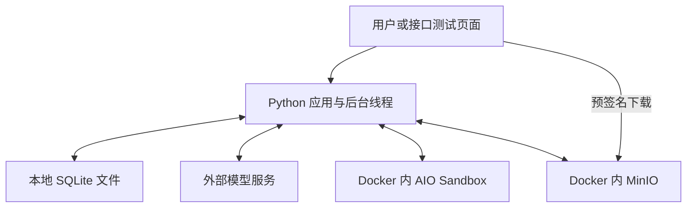
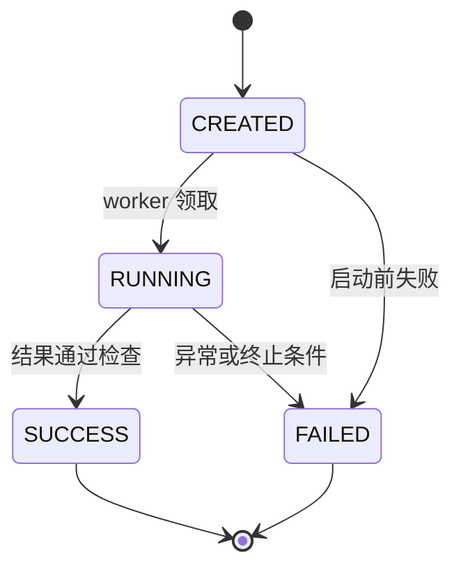
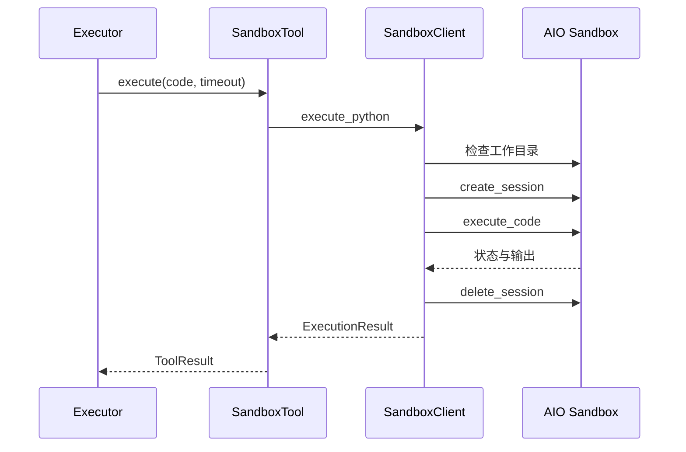

# Document Specialist Agent：从项目设计到 Agent 执行的系统学习手册

本文的目标是让你能沿着真实代码讲清楚：项目做了什么、为什么要这样设计、一个请求怎样变成工具调用、代码在哪里运行、文件如何交付，以及简历中的每项承诺对应什么实现。

本文对照 `feat/security-retry-foundation` 分支编写，运行代码基准为 `98e8895039c429248dd69ac8ae947d148ab9d206`。本次扩写只更新学习文档。代码验证依据见 [学习版验证记录](verification/02_learning_runtime.md)。

**当前定位是单机、单用户 Agent Runtime 原型。** 学习所需的功能链路已经具备；真实模型、Docker/MinIO 联合验收仍单独记录。沙箱超时后可能继续执行的 SEC-001 按约定延期，本文不会把它描述成已解决。详见 [已知问题](KNOWN_ISSUES.md)。

## 阅读导航

第一次先读第 1—6 章，建立业务、架构和主调用链；第二次读第 7—13 章，逐项理解简历；第三次读第 14—18 章，运行实验并练习表达。不必一次背完所有方法。

1. [项目究竟做什么](#s1)
2. [Agent 基础概念与技术底座](#s2)
3. [从业务问题推导设计](#s3)
4. [系统在哪里运行，怎样组装](#s4)
5. [一次工资报表任务的完整过程](#s5)
6. [读懂三层架构与 Agent Loop](#s6)
7. [Tool Calling 和可插拔 Registry](#s7)
8. [任务、步骤、异步队列与持久化](#s8)
9. [执行轨迹与失败定位](#s9)
10. [Docker Sandbox 与执行边界](#s10)
11. [文档处理、产物与预签名 URL](#s11)
12. [异常分类、重试与有限恢复](#s12)
13. [怎样避免无限调用](#s13)
14. [Memory、Evaluation 与 MCP](#s14)
15. [逐条对照简历](#s15)
16. [运行、阅读代码与动手实验](#s16)
17. [面试讲解与追问](#s17)
18. [术语、检查清单与后续方向](#s18)

<a id="s1"></a>
## 1. 项目究竟做什么

### 1.1 用一个用户需求理解项目

用户上传员工表，说：“筛选 IT 部门中绩效为 A 或 S 的员工，计算平均薪资，生成 CSV 报告并给我下载链接。”

普通聊天模型可能解释怎么处理、给出一段代码，或直接写一段回答。本项目要把这件事真正组织成一个执行过程：接收文件、规划、调用工具、在沙箱运行生成代码、检查文件、上传对象存储、返回结果，并留下执行记录。

输入是**自然语言任务 + 可选文件 + 可选产物要求**。输出是**任务状态 + 最终回答 + 经过校验的产物信息 + 执行轨迹**。

本项目当前支持 CSV、XLSX、TXT、MD、JSON。不要把“文档处理”理解成已经支持所有 PDF、Word、图片 OCR；这些并未在当前解析器中实现。

### 1.2 Agent Runtime 是什么意思

可以把 Runtime 理解为“让模型的决策能够被执行和管理的运行程序”。它负责模型之外的工作：哪些工具允许调用、参数是否正确、代码去哪执行、什么时候结束、失败如何记录、文件如何交付。

模型负责根据上下文提出下一步动作；Runtime 负责校验、执行、记录和反馈。没有这些程序逻辑，模型返回 `run_python` 这个名字并不会让任何 Python 代码自动运行。

### 1.3 为什么是 Agent，而不只是固定脚本

固定脚本预先写死了每一步计算。这里的生产执行器每轮都会调用模型，模型可以根据上一次工具结果选择下一个工具、生成不同代码或修改参数。因此，任务的实际动作不是完全预先固定的。

同时它也有明确约束：工具集合来自开发者注册，权限、参数格式、轮数、预算和产物条件由程序决定。模型的灵活决策放在这些约束中运行。

`demo.learning_demo` 使用固定模型回复，仅用于学习和确定性测试；真实入口 `demo.run_demo` 和 API 使用配置的模型服务。不要用固定 demo 的性质概括生产执行器。

### 1.4 项目的核心价值

| 原本容易出现的问题 | 本项目提供的能力 | 用户看到的效果 |
| --- | --- | --- |
| 模型给代码，但没有实际执行 | 工具调用与沙箱执行适配 | 可以得到实际文件 |
| 多步任务过程不透明 | 计划、实际步骤与可见消息留存 | 能追踪运行到哪一步 |
| 请求要等很久 | 落盘提交、后台 worker、状态查询 | 提交后拿 ID 查询 |
| 工具参数错误或越界 | Schema 校验、工具与路径权限 | 非法调用在执行前被拒绝 |
| 网络抖动导致任务立即失败 | 有条件的分类重试 | 可安全重试的操作有恢复机会 |
| 模型说完成，但文件不合格 | 产物条件检查和有限纠正 | 以文件证据判断交付 |

<a id="s2"></a>
## 2. Agent 基础概念与技术底座

### 2.1 先分清几个词

- **LLM**：根据输入消息生成回答或工具调用的模型服务。它不是本项目自己训练的模型。
- **Prompt / messages**：发给模型的指令、任务、计划和历史工具结果。
- **Tool**：应用实现的一个能力，例如读取文件或执行 Python。
- **Tool Calling**：模型输出结构化的工具名称与参数，应用据此调用工具。
- **Agent Loop**：模型决策、工具执行、反馈、再次决策的循环。
- **Sandbox**：独立的执行环境，用来运行生成代码并减少对应用进程的直接影响。
- **Artifact / 产物**：任务生成的文件，如报告 CSV；与模型最后说的一段话不同。

### 2.2 基于什么构建

当前项目用 Python 自己组织 Agent Loop，没有使用 LangChain、LangGraph 或 Spring AI 来承担编排。理解它时，重点是普通类和方法如何协作。

| 技术 / 组件 | 在本项目承担什么 | 对应代码 |
| --- | --- | --- |
| Python | 编排、工具实现、数据模型、测试 | 整个应用 |
| OpenAI Python SDK + 兼容接口 | 向配置的模型服务发送 chat completion 请求 | [LLMClient](../agent/llm_client.py) |
| 默认 DeepSeek 配置 | `LLM_BASE_URL` 与 `LLM_MODEL` 的默认值，可修改 | [Settings](../core/config.py) |
| FastAPI、Pydantic、Uvicorn | API、请求结构校验、HTTP 服务 | [api/app.py](../api/app.py) |
| jsonschema | 工具注册时检查 Schema，调用时检查参数 | [ToolRegistry](../tools/tool_registry.py) |
| SQLite、sqlite3 | 任务快照、队列状态、长期笔记持久化 | [SQLiteTaskStore](../task/sqlite_store.py) |
| threading、RLock | 后台 worker 与同进程互斥 | [TaskWorkers](../task/worker.py)、[TaskManager](../task/task_manager.py) |
| ContextVar | 让当前线程中的工具拿到当前任务上下文 | [RunContext](../agent/runtime.py) |
| Docker Compose + AIO Sandbox 镜像 | 启动现成沙箱服务，配置资源约束 | [docker-compose.yaml](../docker-compose.yaml) |
| agent-sandbox SDK 0.0.30 | 通过服务接口读写文件、创建 Jupyter 会话、执行代码 | [SandboxClient](../sandbox/client.py) |
| boto3 + MinIO/S3 兼容存储 | 上传、下载和生成临时下载 URL | [StorageManager](../storage/storage_manager.py) |
| csv、openpyxl | 本地解析和检查 CSV/XLSX 字节内容 | [documents/files.py](../documents/files.py) |
| 可选 MCP Python SDK v1 | 与独立文档解析服务通信 | [MCPDocumentTool](../tools/mcp_document_tool.py) |
| pytest、unittest、GitHub Actions | 自动化验证业务逻辑与部分真实协议 | [tests](../tests)、[CI](../.github/workflows/tests.yml) |

“使用 OpenAI SDK”描述的是客户端库，不代表必须使用 OpenAI 模型。本项目把 `base_url`、模型名和 key 配置化，默认指向 DeepSeek 的兼容接口。

### 2.3 哪些是现成底座，哪些是项目实现

现成底座包括模型服务、Docker、AIO Sandbox 的执行服务、MinIO、SDK 和解析库。本项目主要实现三层编排、调用循环、任务模型、工具规范与分发、权限策略、错误分类和重试、持久化、文件交付，以及 Memory/Evaluation。

准确表达是“基于现成沙箱服务构建 Runtime，并封装执行适配和可靠性控制”。不应表达成“自己实现了 Docker 隔离机制或从零开发了 Jupyter 内核”。

### 2.4 用 Java 经验帮助理解 Python 代码

| Python 写法 | 在这里表示什么 | 可以借助的 Java 概念 |
| --- | --- | --- |
| `@dataclass` | 自动生成常用初始化等方法的数据对象 | DTO / 实体类 |
| `ABC`、`@abstractmethod` | 要求子类实现统一接口 | 抽象类 / 接口 |
| `__init__` 中传入 llm、registry | 依赖由外部组装，便于替换和测试 | 构造器注入 |
| `with store.transaction()` | 进入操作范围，结束后提交或回滚 | 事务边界 |
| `try / except / finally` | 捕获异常，并确保执行清理 | Java 同类异常结构 |
| `ContextVar` | 按当前执行上下文取任务信息 | 可先类比 ThreadLocal，但二者语义不完全相同 |

先把这些当成组织代码的工具，不必先精通 Python 的所有语法。

<a id="s3"></a>
## 3. 从业务问题推导设计

这一章回答“为什么这样设计”，而不是只背有哪些类。

### 3.1 为什么需要三层

用户的一个请求可能涉及读文件、生成代码、执行、检查和上传。如果把所有逻辑放在一个函数里，模型规划、实际执行和状态更新会混在一起，很难测试，也难定位错误。

因此拆出三种职责：Orchestrator 管整个任务，Planner 产出计划，Executor 负责多轮实际调用。换模型、换工具或换存储时，就不需要一起改动整个流程。

### 3.2 为什么工具要有统一协议

读取文件返回文本，执行代码返回 stdout/error，上传文件返回 URL。执行器如果直接理解每种 SDK 响应，会充满特殊分支。

所以先用 BaseTool 统一“名称、描述、参数 Schema、execute”，再用 ToolResult 统一结果。Registry 做名称到工具对象的映射。执行器只消费统一协议。

### 3.3 为什么执行状态与文件交付要独立管理

模型返回最终回答，不代表文件存在；工具执行失败，也不代表代码完全没产生副作用；HTTP 请求返回，更不代表后台任务已经结束。

因此分别保存任务状态、步骤状态、尝试事件和产物元数据。这些记录用于回答不同的问题，不能仅凭一条“成功”字符串判断全部过程。

### 3.4 设计选择与代价

| 设计 | 解决的问题 | 当前承担的代价 |
| --- | --- | --- |
| 一行 JSON 保存整个任务 | 实现简洁，容易读懂、恢复对象 | 每次更新整个快照；不适合大规模日志查询 |
| SQLite CREATED 状态作为队列 | 不增加消息中间件，提交先持久化 | 轮询扫描；不是高吞吐分布式队列 |
| 每次 Python 调用新建会话 | 减少不同调用共享变量的干扰 | 跨调用数据要保存到文件 |
| 按任务划分目录与对象前缀 | 避免普通任务文件混用 | 目录区分不是恶意多租户隔离 |
| 默认禁止有副作用工具自动重放 | 降低重复执行产生的影响 | 某些瞬态错误不能自动恢复 |
| 长期笔记关键词检索 | 不引入向量服务，学习成本低 | 语义召回能力有限 |

面试时能说出代价，比只说“可扩展、高可靠”更有说服力。

<a id="s4"></a>
## 4. 系统在哪里运行，怎样组装

### 4.1 部署位置：不要把模型、应用、沙箱看成一个进程



应用进程保存任务、决定怎样调用 SDK；生成代码通过 SDK 发到沙箱运行。模型服务只看到发送过去的消息和工具说明，不会天然看到整个沙箱目录。需要读取文档时，应用通过工具取出信息，再把相应结果放进模型上下文。

产物上传也由应用完成：先从沙箱下载文件字节，再用 boto3 上传到对象存储。当前并不是让模型拿到存储密钥自行上传。

### 4.2 `build_orchestrator()` 是组装入口

打开 [agent/wiring.py](../agent/wiring.py)，按下列顺序读：

1. 加载 Settings，得到服务地址、模型名、路径、权限、预算等。
2. 创建 SandboxClient 和 StorageManager，封装两类外部服务。
3. 创建 PermissionManager 和 ToolRegistry。
4. 注册 run_python、read_file、save_report、read_step_output、parse_document。
5. 创建 SQLiteTaskStore，再交给 TaskManager。
6. 创建一个 LLMClient，传给 Planner 和 Executor。
7. 创建 NoteMemory，把所有依赖交给 AgentOrchestrator。

这叫“依赖组装”：业务类通过构造器接收依赖。测试时能把外部服务替换成 fake，不必真的启动模型和 Docker。

### 4.3 两个运行入口有什么区别

- `demo.run_demo` 调 `orchestrator.run(...)`：先建任务，再在当前调用中执行，命令行等待结果。
- API 的 `POST /tasks`：只创建持久化任务；worker 稍后领取，调用 `orchestrator.run_task(..., claimed=True)`，调用方通过 GET 查询。

它们最终进入相同的规划和执行代码。**三层架构是职责划分，不是三个服务，也不是三个并行自治 Agent。**

<a id="s5"></a>
## 5. 一次工资报表任务的完整过程

本章使用 [demo/run_demo.py](../demo/run_demo.py) 的员工数据。后面的消息、ID 和调用顺序为教学示例，实际模型可以采用不同工具顺序；不代表某次真实模型的运行日志。

### 5.1 输入与预期结果

```csv
Name,Department,Salary,Performance
Alice,IT,15000,A
Bob,HR,8000,B
Charlie,IT,18000,S
David,IT,12000,B
```

任务：筛选 IT 部门、绩效 A 或 S，生成保留 Name/Salary 的报告，说明平均薪资。

应保留 Alice 和 Charlie，平均薪资是 `(15000 + 18000) / 2 = 16500`。输出 CSV 至少应有 Name/Salary 列及 2 行数据。这里的列和行数可交给程序检查；“是否确实选中了正确员工、平均数是否正确”还需要业务核验。

### 5.2 接口请求怎样表示文件

CreateTaskRequest 接收 `user_input`、`inputs`、`artifact_requirements`、可选 `memory_note`。文件以 Base64 字符串进入 JSON，应用解码成 bytes。

下面是生成请求字典的示例，不会发送请求：

```python
import base64

source = "Name,Department,Salary,Performance\nAlice,IT,15000,A\nCharlie,IT,18000,S\n"
request = {
    "user_input": "筛选 IT 部门中绩效 A 或 S 的员工，保存报告并计算平均薪资",
    "inputs": [{
        "filename": "input.csv",
        "content_base64": base64.b64encode(source.encode("utf-8")).decode("ascii")
    }],
    "artifact_requirements": {
        "required": True,
        "format": "csv",
        "required_columns": ["Name", "Salary"],
        "min_rows": 2
    }
}
```

Base64 是字节编码，不是加密。当前最多 5 个输入，解码总大小不超过 2 MiB；输入必须非空、文件名不能越界。

### 5.3 从 POST 到运行结束：逐步跟踪

| 顺序 | 实际方法 / 组件 | 做什么 | 关键输出 |
| --- | --- | --- | --- |
| 1 | `CreateTaskRequest.validate_inputs()` | 校验请求、文件名、Base64 和大小 | 合法请求 |
| 2 | `TaskManager.create_task()` | 在事务内检查队列容量并保存 Task | task_id，CREATED |
| 3 | API 返回 | 返回 ID 和创建时的快照 | HTTP 201；不等于任务已完成 |
| 4 | `TaskWorkers.run_once()` → `claim_next()` | 原子领取 CREATED 任务，改为 RUNNING | 获得执行权 |
| 5 | `AgentOrchestrator.run_task()` | 建立 RunContext，记录截止时间、工具预算 | 当前任务上下文 |
| 6 | `SandboxClient.prepare_task()` | 在沙箱创建 `tasks/<id>` 目录 | 任务工作区 |
| 7 | `write_bytes_file()` | 把输入写进当前任务目录 | input.csv |
| 8 | Memory + prompt 组装 | 加入路径、产物要求和可选历史笔记 | 规划输入 |
| 9 | `Planner.plan()` | 请求模型输出结构化计划 | Plan |
| 10 | `TaskManager.save_plan()` | 保存完整计划 | metrics.plan |
| 11 | `Executor.run()` | 反复调用模型和工具 | 实际 TaskStep、反馈消息 |
| 12 | `ReportTool.execute()` | 校验生成文件，再上传并签名 | URL 与 artifact 元数据 |
| 13 | Orchestrator 最终检查 | 检查预算、非空回答和必需产物 | SUCCESS 或 FAILED |
| 14 | API 查询 | 从 SQLite 取任务快照 | 结果、步骤、轨迹、产物信息 |

### 5.4 模型看到的执行上下文

Executor 的 system 消息要求模型按计划调用工具、最后回答；user 消息包含任务文本和 `plan.summary()`。Orchestrator 已把任务目录、可用输入文件名、对象前缀和产物要求拼入任务文本。

所以模型知道要使用 `input.csv`，也知道上传 key 应位于 `reports/<task_id>/`。模型不知道的细节由工具完成，例如 MinIO 密钥、SQLite 事务和 SDK 响应归一化。

### 5.5 一个可能的工具序列

1. `parse_document({"filename": "input.csv"})`：获得表头、行数、部分数据。
2. `run_python({"code": "...读取 CSV、筛选并生成 high_performers.csv..."})`：在沙箱执行模型生成代码。
3. `save_report({"sandbox_filename": "high_performers.csv", "oss_key": "reports/<task_id>/high_performers.csv"})`：校验、上传、获得 URL。
4. 模型收到上传结果后返回自然语言回答，说明平均薪资和下载入口。

如果每轮只调用一个工具，这条理想路径通常是 1 次规划请求 + 4 次执行器模型请求。它只是示例计数，不是项目规定的固定调用次数；多工具同轮、失败重试和纠正都会改变计数。

### 5.6 看文件经过了哪些位置

| 阶段 | 保存形态 | 位置 |
| --- | --- | --- |
| 提交 | Base64 文本 | 请求体；任务快照也保留输入 |
| 准备执行 | 文件字节 | 沙箱 `/home/gem/workspace/tasks/<id>/input.csv` |
| 生成报告 | CSV 文件 | 同一任务沙箱目录 |
| 上传 | 文件 bytes | 经应用进程传给 boto3 |
| 交付 | 对象 + 临时 URL | MinIO bucket 中的 `reports/<id>/...` |
| 查询 | 元数据和执行记录 | SQLite Task 快照 |

这条“数据流”与前面的“方法调用链”是同一件事的两个视角。

<a id="s6"></a>
## 6. 读懂三层架构与 Agent Loop

### 6.1 Orchestrator：管理任务整体生命周期

[AgentOrchestrator.run_task()](../agent/orchestrator.py) 关注的是“这个任务能否正确开始和结束”。

它先取得执行权，再准备输入、运行 Planner、保存计划、运行 Executor、检查结果。发生异常时，把尚未结束的任务标为 FAILED；`finally` 记录执行耗时。成功后可以保存用户明确提供的长期笔记，笔记保存失败不会把已经成功的任务改成失败。

重复启动的检查在主异常处理之前进行。这避免第二个调用者因为“任务已经 RUNNING”而把第一个调用者正在执行的任务错误标成 FAILED。

### 6.2 Planner：用结构化工具声明获取计划

[Planner.plan()](../agent/planner.py) 不要求模型随意写一段自然语言计划，而是提供一个名为 `create_plan` 的工具声明，并通过 `tool_choice` 指定它。

模型返回类似：

```json
{
  "steps": [
    {"name": "查看输入", "description": "确认员工表字段", "tool": "parse_document"},
    {"name": "筛选统计", "description": "筛选员工并生成 CSV", "tool": "run_python"},
    {"name": "交付报告", "description": "保存报告并返回链接", "tool": "save_report"}
  ]
}
```

应用读取返回参数，创建 `Plan` 和 `PlanStep` 数据对象。这里的 `create_plan` 是用于获得结构化输出的声明，不是 Registry 中真正执行文件操作的工具。

Planner 会检查有没有工具调用、能否解析 JSON、计划是否为空；当前没有单独对整份计划执行完整 JSON Schema 二次校验。不要把 Registry 的严格参数校验误算到 Planner 上。

### 6.3 PlanStep 与 TaskStep 为什么不同

PlanStep 是“建议怎么做”，包含 name、description、可选 tool。TaskStep 是“实际调用了什么”，含工具名、输出、错误、状态和尝试次数。

当前 Executor 不会遍历 Plan.steps 并照单执行，它把 `plan.summary()` 提供给模型，再根据模型实际的 tool_calls 创建 TaskStep。模型可能补读一次文件，或在代码失败后生成新代码，所以实际步骤可以多于计划步骤。

完整 Plan 会持久化，但 `summary()` 主要包含步骤名与工具名，不会把每个 description 原样展开。计划因此是模型执行的指导，不是强制 DAG 或可校验的工作流图。

### 6.4 Executor：核心循环在什么地方

打开 [Executor.run()](../agent/executor.py)，重点看这一段教学伪代码，它省略了日志和异常细节：

```python
for round_index in range(max_iterations):
    check_budget()
    messages = compact_messages(messages)
    response = llm.chat(messages, tools=registry.to_openai_tools())
    append_assistant_message(response)

    if not response.tool_calls:
        check_required_artifact_or_request_correction()
        return response.content

    for call in response.tool_calls:
        step = create_and_start_step(call)
        result = invoke_with_retry(call)
        save_step_result(step, result)
        if result.terminal:
            raise UnsafeExecutionStateError()
        append_tool_message(call.id, result)
```

每一轮都把工具执行结果补进 messages，再发给模型。循环返回的最终文本交由 Orchestrator 做最后检查。

### 6.5 LLMClient 负责什么

[LLMClient.chat()](../agent/llm_client.py) 组装 model/messages/tools/tool_choice，通过 SDK 发出请求。它还限制模型请求等待时间，记录耗时、token usage 与异常类型。

Planner 和 Executor 使用同一个 LLMClient 实例，不代表共用一个长期会话：每次请求的“记忆”来自传入的 messages。服务商不会因为 Python 对象相同，就自动知道此前所有任务。

<a id="s7"></a>
## 7. Tool Calling 和可插拔 Registry

### 7.1 模型到底返回了什么

示例工具调用消息如下，里面的 `arguments` 是 JSON 字符串：

```json
{
  "role": "assistant",
  "tool_calls": [{
    "id": "call_read_1",
    "type": "function",
    "function": {
      "name": "parse_document",
      "arguments": "{\"filename\":\"input.csv\"}"
    }
  }]
}
```

Executor 用 `json.loads` 解析 arguments，Registry 根据 name 找到 Python 对象，再执行 `tool.execute(**arguments)`。模型没有直接调用 Python 方法，这个调用动作由应用完成。

执行结果回传时必须引用相同 ID：

```json
{
  "role": "tool",
  "tool_call_id": "call_read_1",
  "content": "{\"columns\":[\"Name\",\"Salary\"],\"row_count\":4}"
}
```

模型由此知道该结果对应哪个调用。上面的 content 仅展示格式，实际 parser 还会返回 format 和 preview。

### 7.2 BaseTool 与 ToolResult

[BaseTool](../tools/base_tool.py) 要求每个工具提供：

| 成员 | 作用 |
| --- | --- |
| name、description | 告诉模型工具叫什么、有什么用途 |
| parameters_schema() | 描述参数类型、必填字段和约束 |
| execute() | 真正实现工具功能 |
| retry_safe | 开发者是否声明可安全自动重放，默认 False |
| required_permissions | 调用工具需要哪些能力 |
| file_parameters、object_key_parameters | 哪些参数需要路径或对象前缀检查 |

ToolResult 包含 success、output、error、error_type、terminal 和可选 artifact。模型通常看到 `to_text()` 的结果；应用同时读取结构化字段来更新步骤、记录产物或停止任务。

`terminal=True` 是“执行状态不安全或不确定，整个任务应停止”，不是普通的某个步骤失败。

### 7.3 Schema 为什么不能省

以 read_file 为例，Schema 要求 filename 是字符串，且不接受额外字段。没有校验时，模型可能传 `filename: 123`、遗漏参数，或增加应用不支持的字段。

Registry 在真正调用工具前验证这些输入，错误转为 `INVALID_ARGUMENT`。Executor 可以把这个失败结果反馈给模型，让模型产生新参数；不会把错误参数直接传进 SDK。

注册时也会检查 Schema 本身，拒绝重复工具名和外部 `$ref`，避免运行时去解析工具声明中的外部引用。

### 7.4 Registry 的调用顺序

实际 `execute(name, arguments)` 的顺序是：

1. 工具名是否已经注册。
2. 工具是否在允许名单内，所需能力是否齐全。
3. 参数是否为字典并符合 Schema。
4. 文件路径、对象 key 是否满足权限规则。
5. 调用具体工具的 execute。

未知工具返回 INVALID_ARGUMENT；无权调用返回 PERMISSION_DENIED。Registry 处理明确的 PermissionDenied，其余工具异常由 Executor 捕获并分类，职责并不完全相同。

### 7.5 “动态发现”在本项目里的准确含义

Registry 存有当前已注册工具，每次模型请求调用 `to_openai_tools()`，把获准使用的工具 Schema 发给模型。模型可以根据描述在这份列表中选工具。

新增普通工具的操作是：实现 BaseTool → 编写 Schema 和逻辑 → 添加测试 → 在 wiring 注册 → 在 ALLOWED_TOOLS/权限配置中启用。一般不需要改 Executor。

当前没有目录自动扫描、插件热加载或自动安装未知工具。“可插拔”描述接口和注册机制；“动态发现”描述模型获取当前允许的工具列表。

### 7.6 当前五个工具

| 工具 | 实际功能 | 代码执行位置 | 默认自动重放 |
| --- | --- | --- | --- |
| read_file | 从沙箱读取文本 | 沙箱文件服务 + 应用适配 | 可，仍需错误可重试 |
| parse_document | 取字节、解析 CSV/XLSX 等并返回预览 | 默认在应用；可切换 MCP 服务 | 本地实现可；MCP 实现默认不可 |
| run_python | 执行模型生成的 Python | AIO Sandbox 的 Jupyter 会话 | 不可 |
| save_report | 读文件、校验、上传、签名 | 应用协调沙箱与对象存储 | 不可 |
| read_step_output | 读取当前任务旧步骤输出的一段 | TaskManager / SQLite | 可 |

“使用 Docker 隔离代码执行”主要指 run_python，不能说项目所有文件解析都在 Docker 中完成。

<a id="s8"></a>
## 8. 任务、步骤、异步队列与持久化

### 8.1 任务—步骤两级状态模型

[Task](../task/task_model.py) 是一次用户请求，主要字段包括 id、user_input、inputs、artifact_requirements、status、steps、result、error、metrics、created_time、updated_time。

TaskStep 是一次模型要求的工具调用，包括 id、name、tool、status、output、error、started_at、finished_at、duration_ms、attempts。一次工具调用内部发生重试时，仍是同一个 TaskStep，只是 attempts 增加。



步骤对应 PENDING → RUNNING → SUCCESS/FAILED，也允许 PENDING → FAILED，供中断时收尾。SUCCESS/FAILED 不能再次 start。任务成功不要求历史每个步骤都成功：模型可能在一个步骤失败后通过新步骤完成任务。

### 8.2 为什么通过 TaskManager 修改状态

如果业务代码到处直接改 `task.status`，容易漏时间、漏日志或忘记写数据库。TaskManager 把状态转换、生命周期事件和存储更新放在一起执行。

例如 fail_task 不只改 Task，还会把未完成的 PENDING/RUNNING 步骤标为 FAILED，记录终止原因。这样任务结束后，不会继续显示其中一个步骤还在运行。

但这只是应用状态收尾，不会自动终止容器中的进程。状态管理与进程控制必须分开理解。

### 8.3 SQLite 怎样保存整个任务

当前 tasks 表的真实定义很简单：

```sql
CREATE TABLE IF NOT EXISTS tasks (
    id TEXT PRIMARY KEY,
    data TEXT NOT NULL
);
```

写入前用 `task.to_dict()` 转成字典，再 `json.dumps()` 转成 JSON 字符串。读出后 `json.loads()`，再 `Task.from_dict()` 恢复枚举、步骤和字段。

它实现了逻辑上的任务—步骤两级模型，但没有拆成任务表、步骤表、事件表三张关系表。这样容易学，代价是每次保存整个快照，查询大量事件时不如专门的日志表方便。

### 8.4 为什么线程锁还不够

同一个 TaskManager 的 RLock 只能保护使用该锁的线程。如果另一个管理器或另一个进程也读取数据库，不能依赖这个锁协调。

比如两个 worker 都读到任务是 CREATED，如果读取和修改不是一个事务，就可能都决定执行。因此 `claim_next()` 在事务内查找 CREATED 任务并调用 start_task。

SQLiteTaskStore 使用 `BEGIN IMMEDIATE`，提前取得写事务权限；竞争者要等待，随后再读取最新状态。领取完成后提交事务，再开始耗时的模型调用，**不会在整个模型执行期间持有数据库事务**。

当前 get/list 也通过同一 transaction 方法运行，读操作同样会进入写事务。这是简单实现的性能代价，不是高并发数据库设计。

### 8.5 ContextVar 为什么出现在这里

多个 worker 共用工具对象，但任务的工作区、对象前缀和预算不同。如果把 `current_task_id` 直接写成全局变量，一个线程可能覆盖另一个线程的数据。

RunContext 保存 task_id、manager、deadline、max_tool_calls、workspace、report_prefix、requirements。Orchestrator 进入 `run_scope(context)`，工具通过 `current_run.get()` 取得当前任务信息；退出时 reset。

这样工具不必在每个模型参数里暴露 task_id 或让模型自行选择任务身份。线程之间的上下文不会因为共用工具对象而直接混用。

### 8.6 异步是如何实现的

这里的“异步任务”是用户请求与后台执行解耦，不是把每次 LLM 调用都改成 `async def`。

API 的生命周期启动固定数量的 Python 线程。worker 没领到任务时等待 0.2 秒再查；领到任务就执行。默认每个 API 进程 4 个 worker，队列容量默认 100，统计 CREATED 与 RUNNING 的总数。

队列满时在事务里拒绝创建，API 返回 503；正常创建返回 HTTP 201。HTTP 201 只代表任务已接收并持久化，应继续 GET 查询状态。

### 8.7 重启和异常中断分别怎么办

| 场景 | 当前行为 | 原因 |
| --- | --- | --- |
| 正常完成后重启 | SUCCESS/FAILED 和轨迹可查询 | SQLite 已落盘 |
| CREATED 尚未被领取就重启 | 新 worker 能继续领取 | 待执行任务本身就是数据库记录 |
| 正常关闭 API | 停止领取并等待活动线程结束 | 尽量保留正常终态 |
| 强杀进程，任务停在 RUNNING | 不自动重新执行 | 无法证明原代码没有副作用 |
| 所有 worker 已停止后手动恢复 | RUNNING 与未完成步骤标记为不确定失败 | 先保留事实，避免盲目重放 |

恢复命令：

```powershell
.\.venv\Scripts\python.exe -m task.recover --db data/tasks.sqlite3 --workers-stopped
```

只能在所有 API/worker 已停止时使用。它不检查沙箱进程是否停止，也不提供自动租约或心跳恢复；操作后仍需确认执行环境再创建新任务。

<a id="s9"></a>
## 9. 执行轨迹与失败定位

### 9.1 先分清四种编号

| 标识 | 谁产生 | 代表什么 |
| --- | --- | --- |
| task_id | Task 创建时 | 一次用户任务 |
| step_id | Executor 创建 TaskStep 时 | 一次实际工具调用步骤 |
| tool_call_id | 模型工具调用响应 | 模型消息中的某次调用，用于反馈配对 |
| attempt | Executor 重试循环 | 同一个步骤的第几次工具尝试，从 1 开始 |

例如：任务 T1 下的步骤 S2，对应 call_2；第一次连接失败，第二次成功。两次尝试共享 T1/S2/call_2，attempt 分别为 1、2。模型修改参数重新发出调用时，则会创建新的步骤。

### 9.2 什么记录放在哪里

| 位置 | 内容 | 排查用途 |
| --- | --- | --- |
| Task.result / error | 最终结果或任务失败信息 | 先看任务为什么结束 |
| Task.steps | 实际工具、输出、错误、耗时、尝试数 | 找到失败步骤 |
| metrics.plan | 完整结构化计划 | 对照计划与实际动作 |
| metrics.lifecycle_events | 创建、开始、成功、失败等状态事件 | 看生命周期 |
| metrics.llm_request_events | Executor 各轮发送前的 messages 快照 | 看模型当时得到什么上下文 |
| metrics.message_events | Executor 收到的 assistant 和回传的 tool 消息 | 看工具决策与反馈 |
| metrics.tool_call_events | 关联 step/call 的 STARTED、SUCCESS/FAILED | 对齐调用边界 |
| metrics.retry_events | 每次尝试的错误类别、耗时、决策和状态 | 分析为什么重试或不重试 |
| metrics.security_events | 明确的权限拒绝事件 | 看拒绝原因 |
| metrics.llm_events | 模型、耗时、usage、异常类型 | 看调用开销 |
| metrics.artifacts | 文件大小、校验信息、SHA-256、key、URL | 核验交付物 |
| metrics.termination_reason / duration_ms | 任务终止原因与执行耗时 | 区分完成、预算或其他失败 |

事件使用 task_id、时间和列表内 sequence；各类事件的 sequence 是各自递增，不是跨所有列表统一的全局序号。

### 9.3 为什么每次尝试都立刻写入

Executor 在一次工具尝试结束后写 retry_events，然后才等待退避。如果全部重试结束才一次性写，等待过程中进程崩溃，就看不到前几次失败发生过。

事件参数使用深拷贝，避免后面继续修改 messages 时，把之前保存的“请求快照”一起改掉。对于学习版内存存储，浅拷贝尤其容易出现这个问题。

### 9.4 “完整执行轨迹”的准确边界

当前保存了应用可见的主要业务执行链，但它不是分布式 tracing 平台，也不是每条指令的审计系统。

Executor 的请求和回复有快照；Planner 保存结果和 LLM 调用指标，没有同等的逐消息请求快照。工具 STARTED 与尝试结束记录之间如果进程崩溃，不能凭数据库断言外部操作到底完成到哪里。模型隐藏推理不保存，清理 SDK 的每个底层请求也没有单独事件表。

因此面试可以解释“实现了任务、步骤、调用和重试关联的可见执行轨迹持久化”，但不应说“所有底层操作都有完整分布式审计”。

### 9.5 实际定位一个失败任务

建议按这个顺序查看：

1. GET /tasks/{id}：看 status、error、termination_reason。
2. 查看 steps 中哪个步骤失败、调用了哪个工具。
3. 用 step_id 对齐 tool_call_events 和 retry_events。
4. 看错误类型、attempt、retry_reason，判断是参数、权限、瞬态错误还是执行不确定。
5. 回看相应 llm_request_events / message_events，确认模型拿到的上下文与生成参数。
6. 如果已经有 artifacts，单独核验文件；任务失败不保证从未上传过文件。

这是“支持失败定位与链路追踪”的具体实现，不需要先引入复杂监控系统才能理解。

<a id="s10"></a>
## 10. Docker Sandbox 与执行边界

### 10.1 为什么不直接在应用里 `exec(code)`

生成代码可能死循环、消耗大量内存、读取不该读取的文件或产生错误。直接在 API 进程执行，会把这些行为直接放进应用的权限和资源范围。

本项目通过 SDK 调用 Docker 内的 AIO Sandbox。这样生成代码的执行环境与应用代码分开，并可以给沙箱容器配置资源上限。这里是减少风险的工程边界，不是保证任何恶意代码都绝对安全。

### 10.2 一次 run_python 的真实调用链



路径检查通过沙箱 shell 执行固定检查脚本。Python 业务代码通过 Jupyter 接口执行，不是让应用直接启动本机 Python 子进程运行用户代码。

### 10.3 为什么每次创建独立会话

`execute_python()` 生成新的 `doc-<uuid>` 会话，执行结束后在 finally 删除会话。这样上次调用里定义的变量，不应该成为下一次调用隐含依赖。

因此模型不能第一轮只定义变量 `df`，下一轮假设它还在。需要在一次调用里完成关联计算，或把中间结果写成任务目录中的文件。

当前容器是共享的，不是每个任务启动一个 Docker 容器；独立会话也不代表独立文件系统。

### 10.4 SDK 响应为什么还要归一化

底层 SDK 返回 envelope，执行状态和 outputs 可能位于 `.data`。outputs 又包括 stream、error、display_data 等类型。SandboxClient 将它们转换成自己的 ExecutionResult：status、stdout、stderr、error、traceback、outputs、execution_uncertain。

SandboxTool 再把 ExecutionResult 转成 ToolResult。执行器由此无需依赖某个 SDK 版本的内部类型。

未知响应、服务端失败 envelope、执行请求异常或无法确认会话清理，会触发不确定状态处理。这样不会因为“没读懂返回值”就误报执行成功。

### 10.5 配额到底限制什么

当前 [docker-compose.yaml](../docker-compose.yaml) 的默认配置：

| 配置 | 默认值 | 含义 |
| --- | --- | --- |
| cpus | 2.0 | 整个沙箱容器可用 CPU 配额 |
| mem_limit | 4g | 整个容器内存上限 |
| memswap_limit | 与内存上限相同 | 不通过额外 swap 放大总额度 |
| pids_limit | 512 | 容器进程数上限 |
| shm_size | 2gb | 共享内存配置，不等于总内存限制 |
| 端口映射 | 127.0.0.1 | 默认只通过本机端口访问服务 |

这些是整个容器的总额度，多个任务会共享，不是每个 Task 都能各用 4 GiB。用户此前真实 Docker 验证通过了配额检查。

### 10.6 路径检查能防住什么

应用层拒绝 `..`、不合规字符、工作区之外路径；固定脚本在沙箱里检查路径及父级是否已有符号链接。ReportTool 还要求对象 key 在当前任务前缀之内。

这些限制用于规范提供给工具的文件参数。它们没有逐条分析任意 Python 代码中的文件操作，也不能保证代码不能通过绝对路径接触共享容器的其他区域。符号链接检查与实际 IO 之间也存在并发替换的 TOCTOU 边界。

当前 Compose 使用 `seccomp:unconfined`，没有构成严格的恶意代码防护方案；没有网络隔离、每任务容器等完整多租户措施。面试要区分“容器隔离与配额”与“完善的恶意代码沙箱”。

### 10.7 已延期的超时问题怎么讲

现有代码有超时参数、任务截止检查和会话清理，但真实烟测证明：沙箱服务可能在超过 timeout 后继续运行并写文件。客户端最终返回 error 或删除会话，并不能证明副作用没有发生。

当前正确表述是：**实现了超时配置、执行不确定状态处理和资源约束；可靠终止生成代码仍有已知缺陷，已记录并延期修复。**

不要说“超时后一定 kill 掉代码”“删除 session 等于所有派生进程都停止”。学习其他模块不依赖把这个问题假装解决。

<a id="s11"></a>
## 11. 文档处理、产物与预签名 URL

### 11.1 输入校验和文档解析是两步

`decode_inputs()` 负责文件名、数量、Base64、非空和总字节限制。`inspect_document()` 负责解读内容。

CSV 使用标准库 csv；XLSX 使用 openpyxl，以只读方式取值并限制展开大小、行列规模；TXT/MD 检查 UTF-8 文本和非空；JSON 还要能解析。

parser 返回的是有限预览，不是把整张大表全部塞入模型。XLSX 不负责执行 Excel 公式，data_only 读取现有缓存值，这点会影响带公式文件的结果。

### 11.2 save_report 的完整过程

打开 [ReportTool.execute()](../tools/report_tool.py)，它做六件事：

1. 从当前 RunContext 得到任务专属 report_prefix。
2. 校验 oss_key 位于允许前缀内。
3. 调 SandboxClient 读取生成文件字节。
4. 用 artifact_metadata 检查格式、内容、列名、最小行数，并计算 SHA-256。
5. 调 StorageManager 上传文件并生成 URL。
6. 返回带 artifact 元数据的 ToolResult，Executor 再把元数据写入任务。

artifact 中的 size_bytes、sha256 说明“交付的是哪份内容”；format、columns、row_count、validated 说明检查了什么；object_key、url、expires_in_seconds 说明从哪里访问。

### 11.3 为什么文件不空还不够

一个 CSV 可能只有表头，或列名完全不对。因此 artifact_requirements 可以指定：

```json
{"required": true, "format": "csv", "required_columns": ["Name", "Salary"], "min_rows": 2}
```

required_columns 表示至少包含这些列，不要求禁止其他列；min_rows 表示最低数据行数。它没有表达“只能有 Alice 和 Charlie”“工资总和必须为 33000”，所以不能把通过结构校验说成业务计算绝对正确。

如果模型没有保存任何合格产物就回答完成，Executor 最多给两次补做提示，然后失败；Orchestrator 在结束前还会再次检查必需产物。

### 11.4 OSS、S3、MinIO 怎么区分

简历写了 OSS，而当前代码使用 `boto3.client("s3", endpoint_url=...)` 连接 MinIO。参数名 `oss_key` 只是项目命名，不证明对接了阿里云 OSS SDK。

准确描述是“将产物上传到对象存储，当前使用 MinIO/S3 兼容接口”。如果面试官特指阿里云 OSS，应明确当前后端与实际验证范围，不要把云厂商产品混为一谈。

本版没有对象存储事务与任务数据库之间的分布式事务。上传成功后签名或数据库保存失败，可能留下对象但任务仍失败，这也是不能随意自动重放的原因之一。

### 11.5 上传和签名分别是什么动作

StorageManager 先 `ensure_bucket()`：检查 bucket，确实不存在才尝试创建。再用 `put_object(Bucket, Key, Body)` 上传 bytes。

随后 `generate_presigned_url("get_object", Params=..., ExpiresIn=3600)` 生成默认一小时有效的临时下载链接。签名一般由 SDK 根据凭据计算；它不是再上传一次，也不是把 bucket 改成公开。

下载时，用户访问带签名和有效期的 URL，对象存储验证请求。用户不需要拿到长期 access key/secret，但拿到 URL 的人通常在有效期内都可以访问对应对象，因此它本身也是需要保护的临时凭证。

URL 到期不等于对象被删除；当前任务记录里的旧 URL 也不会自动刷新。不能把预签名 URL 说成一次性链接、用户身份鉴权或内容加密。

### 11.6 如何验证“安全访问”

[demo/artifact_smoke.py](../demo/artifact_smoke.py) 独立检查真实沙箱生成的 CSV/XLSX 内容、有效签名下载、去掉签名后的匿名拒绝、短期签名过期后拒绝。

这个脚本已提供，但新版真实 Docker/MinIO 联合验证仍需要对应运行环境。它与已延期的 security_smoke 超时探针是不同测试。

<a id="s12"></a>
## 12. 异常分类、重试与有限恢复

### 12.1 为什么不能所有错误都重试

网络暂时断开，再读一次文件可能成功；但 filename 参数错误，原样重试通常不会修好。更关键的是，执行代码或上传失败时，外部操作可能已经产生部分效果，重复执行可能造成重复写入。

因此本项目同时问两个问题：错误是否可能恢复？工具是否允许安全自动重放？只有满足条件并且预算没用完，才进入自动重试。

### 12.2 六类错误

| ErrorType | 示例 | 相同参数自动重试的默认判断 |
| --- | --- | --- |
| TRANSIENT | 连接故障、部分 5xx、429、节流 | 还要检查 retry_safe 和次数 |
| TIMEOUT | 等待超时 | 同样要检查安全性；沙箱不确定执行会 terminal 停止 |
| INVALID_ARGUMENT | Schema 不符、文件不存在、部分 4xx | 不自动重试 |
| PERMISSION_DENIED | 工具禁用、越界、403 | 不自动重试 |
| EXECUTION | SandboxTool 明确报告代码执行错误 | 不原样自动重试，可反馈模型 |
| BUSINESS | 未归入其他类别的业务或执行异常 | 不自动重试 |

`classify_exception()` 先检查具体异常，再检查较宽泛的 OSError 等；还会查看 SDK status_code、boto3 错误信息和包装异常的 `__cause__`。这是为了不把权限错误误当成网络故障。

错误枚举描述的是工具层分类。LLM SDK 的自动重试当前关闭，模型请求失败不会自动走 Executor 的工具重试循环。

### 12.3 决策与执行分开

[RetryPolicy](../retry/retry_policy.py) 只返回 RetryDecision：should_retry、delay_seconds、reason、final。它不执行工具、不 sleep、不写任务数据库。

Executor 负责实际调用、捕获异常、查询策略、写入每次尝试事件、sleep，再决定是否继续。这使重试策略可以不联网单独测试。

### 12.4 指数退避和随机抖动的实际公式

本项目的 `_backoff(attempt)` 是：

```python
raw = base_delay * backoff_factor ** (attempt - 1)
if jitter:
    raw = raw * random.uniform(0.5, 1.5)
delay = round(min(raw, max_delay), 3)
```

默认 base_delay=1 秒，factor=2，max_delay=10 秒，最多 **3 次尝试，包含第一次调用**。

| 已失败的尝试 | 不含抖动的等待基数 | 加入抖动后的范围 | 接下来 |
| --- | --- | --- | --- |
| 第 1 次 | 1 秒 | 0.5—1.5 秒 | 第 2 次尝试 |
| 第 2 次 | 2 秒 | 1—3 秒 | 第 3 次尝试 |
| 第 3 次 | 不再等待 | 无 | 到达次数上限 |

更长的策略也会受 max_delay 截断；代码在乘抖动后再取上限。这里不是“从 0 到上限随机”的 full jitter，而是 0.5—1.5 倍抖动。

指数退避减少对尚未恢复服务的连续冲击；抖动让不同请求错开重试时刻。它提高恢复机会，不保证故障一定恢复。

### 12.5 自动重试与模型纠正有什么区别

**自动重试**：同一 TaskStep、同一参数，再尝试一次；attempt 增加，不需要重新问模型。

**模型纠正**：先把失败作为 tool 消息回传；下一轮模型生成新参数或新代码，形成新的工具调用和新 TaskStep。

例如只读文件连接失败，可能在同一步自动重试成功。代码列名拼错通常不自动重放，而是让模型读到错误后生成新代码。如果执行状态不确定，直接终止，不走这种继续纠正。

### 12.6 幂等与 retry_safe 不是同一回事

幂等表示重复操作不会改变最终效果。retry_safe 是开发者在工具接口上的声明，表示当前场景允许自动重放；它不是系统对任意代码的自动证明。

read_file、read_step_output 通常没有写入副作用，所以声明可重试。run_python 的代码未知，可能写文件、调用网络或执行其他操作，默认不可。save_report 虽然对同一个 key 的重复写入有时表现为覆盖，但仍有上传、签名、记录等部分成功问题，因此保守地不自动重试。

### 12.7 为什么要关闭 SDK 内部重试

LLMClient 使用 `max_retries=0`；沙箱请求选项同样禁止 SDK 自动重试；boto3 配置 `total_max_attempts=1`。这样尽量避免“外层尝试一次，内层已偷偷重试几次”的重复执行和统计混乱。

应用明确记录的重试主要由 Executor/RetryPolicy 控制，不宣称能追踪服务端内部的所有重试。

<a id="s13"></a>
## 13. 怎样避免无限调用

### 13.1 不只是一条 `for` 循环

| 机制 | 配置 / 位置 | 实际约束 |
| --- | --- | --- |
| 最大执行轮数 | MAX_ITERATIONS=8 | Executor 最多请求模型 8 轮；规划请求不计入这 8 轮 |
| 工具尝试预算 | MAX_TOOL_CALLS=24 | 每次工具尝试都消费，包括内部重试 |
| 任务执行截止 | TASK_TIMEOUT_SECONDS=300 | 从 run_task 开始计时，含准备与规划，不含排队时间 |
| 模型 HTTP 等待 | LLM_TIMEOUT_SECONDS=60 | 单次模型请求，还受任务剩余时间收紧 |
| 沙箱参数上限 | 默认 30 秒，最大 120 秒 | 传给服务的执行参数，可靠停止缺陷仍存在 |
| 必需产物纠正次数 | Executor 中最多 2 次 | 没有产物却直接回答时，最多两次要求补做 |
| 上下文字符预算 | CONTEXT_MAX_CHARS=24000 | 裁剪后仍过大则明确失败 |
| 执行不确定终止 | ToolResult.terminal | 不继续让模型调用其他工具 |

max_iterations 不是最大工具调用数：一轮响应可以包含多个 tool_calls；每个工具内部还可能重试。所以需要单独的工具尝试预算。

### 13.2 成功与失败的条件

成功路径要求模型返回最终文本，文本非空，执行预算检查通过；如果 required=True，还必须存在被保存的合格 artifact。然后 Orchestrator 写 SUCCESS。

超过轮数、预算、明确异常、无法确认安全执行、产物缺失等会抛出异常，由 Orchestrator 写 FAILED，并关闭未完成步骤。

没有要求产物的任务允许只返回回答；不能从 SUCCESS 推断一定有下载文件，也不能从 FAILED 推断没有任何副作用。

### 13.3 协作式截止时间的局限

RunContext 使用单调时钟 `time.monotonic()`，在阶段之间和工具尝试开始前检查 deadline。它也在重试等待前判断剩余时间是否足够。

但应用不能靠“下次检查时发现超时”倒回去取消已经发生的写入，也不能靠 Python 条件判断立即中断一个阻塞中的外部 SDK。因此这里实现的是阻止后续动作和正确标记失败；硬终止沙箱执行仍属于单独的安全问题。

<a id="s14"></a>
## 14. Memory、Evaluation 与 MCP

这三项用于补全 Agent 开发视角。先掌握前面的主循环，再学它们；它们不会替代任务状态、工具执行或安全控制。

### 14.1 短期 Memory：让当前任务的上下文可控

模型每一轮都要重新接收 messages。工具输出太长或历史太多，会增加上下文开销，甚至超过模型限制。

当前实现有两层处理：

1. `result_reference()` 对长工具反馈保留前 2000 字符，再追加 task_id/step_id 引用；完整 output 保存在 TaskStep，可用 read_step_output 按 offset/limit 读取，每次最多 2000 字符。
2. `compact_messages()` 在发送前按字符数估算大小。保留最初 system/user 消息和最新结果，移除较早的完整消息组；仍超预算就抛错。

为什么按完整组删除？如果删掉 assistant 的 tool_calls，却保留孤立 tool 消息，模型接口将无法正确对齐调用。反过来只留调用没有结果，同样会破坏上下文结构。因此一次 assistant 调用及其对应 tool 反馈要一起处理。

这个预算只针对 Executor 的序列化 messages，**不是完整请求的精确 token 预算**；工具 Schema 和 Planner 请求没有使用同一裁剪函数。面试应说“通过消息裁剪和大结果引用控制上下文规模”，不要说实现了精确 token 上限。

### 14.2 长期 Memory：明确选择保存的笔记

`memory_note` 是用户主动提供的可复用经验摘要，例如“工资 CSV 先核对表头，再按部门统计”。任务成功后，NoteMemory 把它写入 SQLite 的 memory_notes 表。

应用不会自动把原始工资表或全部模型回答存进长期记忆。笔记会遮盖常见邮件、URL、token 等信息，并限制长度；正则脱敏不能识别所有敏感内容，所以不要提交真实员工隐私。

查询时把英文词、中文相邻双字变成集合，用与查询的交集大小排序，从最近最多 1000 条候选里取最多 3 条有匹配的笔记。随后作为参考资料加入 prompt，不作为更高优先级指令。

这实现了简单的历史经验复用，不使用 Embedding 或向量数据库。任务轨迹和长期记忆是两回事：删除 memory_notes 不会删除 Task 的全部历史消息。

### 14.3 Evaluation：统计的到底是什么

[evaluation/metrics.py](../evaluation/metrics.py) 直接根据持久化任务计算指标：

| 指标 | 当前定义 | 不能误解成什么 |
| --- | --- | --- |
| success_rate | SUCCESS 数 / 已进入 SUCCESS 或 FAILED 的任务数 | 不包含仍在排队、运行的任务 |
| artifact_pass_rate | 要求产物的已结束任务中，有 artifacts 的比例 | 该任务之后仍可能失败，不等于业务计算正确率 |
| retry_rate | attempt>1 的尝试事件数 / 所有工具尝试事件数 | 不是“发生过重试的任务比例” |
| mean_duration_ms | 有耗时记录的已结束任务平均执行时间 | 不含排队等待时间 |
| llm_calls | llm_events 数 | 固定 FakeLLM 没有经过真实 wrapper 时可能为 0 |
| known_total_tokens | 已返回 usage 的 total_tokens 求和 | 未返回的 usage 不代表消耗为零 |
| usage_missing_calls | 没有 total_tokens 的调用数 | 用于提示用量信息缺失 |

调用 `GET /evaluation` 可看当前数据库的累计指标。它不是外部监控平台，也没有接入链路可视化服务。

### 14.4 固定评估集与真实模型评估的区别

[evaluation/cases.json](../evaluation/cases.json) 有三个固定案例：正数 CSV 合计、负数/零 CSV 合计、XLSX 合计。实际读取生成文件并对照 expected_total。

它验证真实编排、持久化、文件结构和确定的业务结果，外部服务与模型使用测试替身。3/3 通过说明这条固定流程符合预期，不能报告成“真实模型成功率 100%”。真实模型需要在相同业务要求下另行运行并核验结果。

### 14.5 MCP：把解析能力放到独立服务

本地 DocumentTool 直接取文件字节并调用 inspect_document。配置 MCP_PARSER_URL 后，wiring 会注册 MCPDocumentTool 替代本地 parser，工具在模型侧仍叫 parse_document。

其调用过程是：读取受限字节 → 编码 Base64 → 建立 MCP HTTP 连接 → initialize → list_tools 验证指定工具存在 → call_tool → 检查结果结构 → 封装 ToolResult。

服务器地址和远程工具名来自应用配置，不由模型参数决定。当前适配器只桥接约定的文档解析工具，不会自动把任意 MCP 服务的全部工具注册到 Registry。

[demo/mcp_parser_server.py](../demo/mcp_parser_server.py) 提供同项目的独立本机服务，使用 SDK v1。协议层与工具调用层的关系是：MCP 负责应用到外部工具服务的标准通信；Tool Calling 负责模型向应用提出动作请求。

<a id="s15"></a>
## 15. 逐条对照简历

下面对照的是用户给出的简历表述。它帮助你建立“说法—设计—代码—证据”的关系，不要求你逐字背诵。

| 简历中的内容 | 项目具体怎样实现 | 核心代码 | 讲解时要带上的边界 |
| --- | --- | --- | --- |
| 面向文档与代码执行构建 Runtime | 文件输入、模型规划、工具循环、沙箱执行、产物交付 | wiring、orchestrator、executor、documents | 单机原型，基于现成模型和沙箱服务 |
| Orchestrator-Planner-Executor 三层 | 整体生命周期 / 结构化计划 / 实际调用循环分离 | agent 三个同名文件 | 不是三个独立 Agent 服务；计划不是强制执行图 |
| 规划 → Tool Calling → 执行 → 反馈 | Schema 发给模型，解析 tool_calls，Registry 分发，结果配对回传 | Planner.plan、Executor.run | 实际执行由应用控制，模型只返回请求 |
| 最大迭代与终止条件 | 轮数、工具尝试数、协作式 deadline、产物条件、terminal | runtime、executor、orchestrator | deadline 不保证硬终止代码 |
| 任务—步骤两级状态 | Task/TaskStep 状态机与统一管理器 | task_model、task_manager | 重试属于同一步，不是每次重试建任务 |
| 异步执行与轨迹留存 | POST 先落盘，worker 原子领取；可见请求、结果、尝试与关联记录 | api、worker、sqlite_store、executor | SQLite 轮询；Planner 原始消息等仍有留存边界 |
| 可插拔 Tool Registry | BaseTool + Schema + 注册表 + 权限 + ToolResult | tools/base_tool、tool_registry | 静态注册后供模型选择，不是热加载 |
| Docker Sandbox 安全执行 | SDK 远程执行、新会话、路径检查、容器资源配额 | sandbox/client、docker-compose.yaml | SEC-001 未关闭；共享容器非恶意多租户隔离 |
| 产物上传 OSS 与预签名 URL | 读取字节、校验、boto3 put_object、presign | report_tool、storage_manager | 当前实际为 MinIO/S3 兼容后端，非已验证的阿里云 OSS |
| 分类异常、退避与抖动 | 分类函数 + RetryPolicy 决策 + Executor 尝试与事件写入 | retry_policy、Executor._invoke_tool | 必须 retry_safe；不自动重放不确定代码 |
| 失败定位与链路追踪 | task_id/step_id/tool_call_id/attempt 与可见轨迹 | task_manager、executor | 不是完整分布式 tracing 或 exactly-once |

### 15.1 总体介绍应该包含什么

先讲场景，再讲链路，最后讲可靠性：

“项目面向文档处理和生成代码执行。用户提交任务与文件后，应用先建立持久化任务，由后台 worker 领取；Planner 生成结构化计划，Executor 根据模型的 Tool Calling 调用已注册工具，把执行结果反馈给模型。生成代码在现成 Docker Sandbox 服务中运行，报告通过校验后上传对象存储。任务、步骤、调用和重试记录都保存在 SQLite，便于查询和定位问题。”

这段话说明了业务、架构、数据和流程，之后再按面试官的问题展开，不必第一句列完全部依赖。

### 15.2 “做了什么、解决什么”怎么组织

可用以下句式，但应按自己的实际贡献范围表达：

- “针对多步执行难追踪的问题，项目把任务和实际工具步骤分层建模，并持久化每次尝试。”
- “针对模型参数不稳定的问题，项目在工具执行前统一做 Schema 与权限检查，再把失败反馈给模型。”
- “针对重复执行的副作用风险，工具需要显式声明可重试；状态不确定时停止整个任务。”
- “针对模型口头完成但没有文件的问题，项目在交付前检查文件和用户指定的结构要求。”

不要把“用了 SQLite”“用了 Docker”本身当成解决问题的完整解释。需要补上它们处于哪条调用链、保护了哪一个环节。

### 15.3 简历中建议更准确的两处表述

如果保持当前实现，产物一句可以表述为：“将执行产物上传至 MinIO/S3 兼容对象存储，并通过预签名 URL 提供限时下载。”

安全一句可以表述为：“基于 Docker Sandbox 隔离生成代码执行环境，配置超时与 CPU/内存/进程数限制，并在执行状态不确定时终止任务。”面试涉及超时可靠性时，要说明已发现并登记的服务端停止缺陷；这句话本身也不应被解释为已验证硬终止。

代码、验证记录和个人实际贡献应共同支撑简历，不用把所有增强模块都写进简历才能讲出项目价值。

<a id="s16"></a>
## 16. 运行、阅读代码与动手实验

### 16.1 第一步：拿到正确版本

当前学习代码在 `feat/security-retry-foundation`，尚未自动合并 main。已有本地仓库时，先检查工作区，不覆盖自己的未提交修改：

```powershell
git status
git fetch origin
git switch feat/security-retry-foundation
git pull --ff-only
```

如果本地分支不存在，可用 `git switch --track origin/feat/security-retry-foundation`。如果快进失败，先查分支差异，不使用 reset --hard 覆盖工作。

### 16.2 安装与运行：先用离线示例

建议 Python 3.12 或 3.13。已有项目 `.venv` 直接使用；没有虚拟环境时才执行创建命令，把版本改成自己已安装的版本：

```powershell
py -3.12 -m venv .venv
.\.venv\Scripts\python.exe -m pip install -r requirements.txt
.\.venv\Scripts\python.exe -m demo.learning_demo
.\.venv\Scripts\python.exe -m evaluation.run
```

Linux/macOS 用 `.venv/bin/python` 替代。学习 demo 不调用真实模型，也不启动 Docker，不会在宿主机运行模型生成代码；它使用开发者预定义的变换和外部服务测试替身。临时目录退出时删除。

看到 SUCCESS 后，要读 steps 和 artifacts，而不只看最后一行。离线示例生成 total=60 的报告，与前文工资业务是不同的教学数据集。

### 16.3 推荐学习顺序与完成标准

| 阶段 | 读哪些方法 | 运行什么 | 学会的标志 |
| --- | --- | --- | --- |
| 1 数据模型 | Task/TaskStep 的 start、succeed、fail | tests/test_task_model.py | 能画状态流转并说明终态 |
| 2 编排 | run_task、plan、run | demo.learning_demo、tests/test_orchestrator.py | 能讲请求到结果的主线 |
| 3 调用循环 | Executor.run、_assistant_message | tests/test_executor.py | 能解释 tool_call_id 与反馈 |
| 4 工具 | register、execute、BaseTool | tests/test_tool_registry.py | 能说明加工具改哪些位置 |
| 5 持久化/队列 | transaction、claim_next、run_once | tests/test_sqlite_store.py、tests/test_api.py | 能解释事务和后台领取 |
| 6 文件/产物 | inspect_document、ReportTool.execute | tests/test_learning_runtime.py | 能区分文件结构与业务正确性 |
| 7 重试/预算 | decide、_backoff、consume_tool | tests/test_retry.py、demo.retry_demo | 能算重试次数并区分安全性 |
| 8 扩展 | compact_messages、search、summarize | evaluation.run | 能解释记忆和评估的具体实现 |

例如只测某一部分：

```powershell
.\.venv\Scripts\python.exe -m pytest tests/test_executor.py -q
.\.venv\Scripts\python.exe -m pytest tests/test_learning_runtime.py -q
```

### 16.4 五个动手练习

**练习一：计划与步骤。** 在 Executor 测试中查看 FakeLLM 返回的两轮消息。标出哪个对象是 Plan，哪个位置创建 TaskStep。解释如果第一步工具失败，为什么仍可能收到最终回答。

**练习二：一次步骤、多次尝试。** 运行 retry_demo，观察 attempt 从 1 增加到 3。说明 max_attempts=3 为什么不是“首次执行 + 3 次重试”。

**练习三：看清文件校验。** 在固定评估案例中观察正数与负数合计。再阅读 `test_artifact_requirements_reject_wrong_shape`，说明为什么空文件、重复表头和不存在的必需列会被拒绝。

**练习四：模拟恢复。** 阅读 `test_pending_queue_survives_reopen` 与 `test_recovery_fails_active_steps_without_replay`。比较 CREATED 与 RUNNING 在重启后为什么采用不同处理。

**练习五：上下文配对。** 阅读 `test_context_compaction_preserves_pairs_and_original`，画出删除前后消息列表；确认 assistant 的调用和 tool 的返回没有被拆开。

参考结论：计划不等于实际步骤；重试共享 step_id；文件验证需要内容证据；中断不能证明没有副作用；工具消息必须成组处理。

### 16.5 真实运行与 API 操作

根据 `.env.example` 补充自己的 `.env`，不要覆盖已有密钥；确认 ALLOWED_TOOLS 包含新工具。启动服务：

```powershell
docker compose up -d
.\.venv\Scripts\python.exe -m uvicorn api.app:app --host 127.0.0.1 --port 8000
```

在浏览器打开 http://127.0.0.1:8000/docs，用 Swagger 页面提交请求、查询任务。API 无登录鉴权，按本机学习服务使用。

下面是可直接放进 POST /tasks 的小例子，Base64 对应 `amount\n10\n20\n`：

```json
{
  "user_input": "读取 input.csv，计算 amount 合计，保存含 total 列的 CSV 报告",
  "inputs": [{"filename": "input.csv", "content_base64": "YW1vdW50CjEwCjIwCg=="}],
  "artifact_requirements": {"required": true, "format": "csv", "required_columns": ["total"], "min_rows": 1},
  "memory_note": "CSV 合计前先核对表头"
}
```

拿到 ID 后调用 GET /tasks/{id}。重点看 status、steps、metrics.retry_events、metrics.artifacts。GET /evaluation 看累计运行指标，DELETE /memory/{task_id} 删除可复用笔记。

也可直接运行 `python -m demo.run_demo`，它执行工资样例。真实入口需要 LLM_API_KEY，会产生模型供应商调用费用。

### 16.6 验证分层：知道自己测了什么

| 命令 / 证据 | 验证内容 | 不能替代 |
| --- | --- | --- |
| `python -m pytest -q` | 核心逻辑、fake 适配、数据库等 | 真实模型与 Docker/S3 联合验收 |
| `python -m demo.learning_demo` | 固定回复驱动的完整学习链路 | 真实模型决策质量 |
| `python -m evaluation.run` | 3 个固定 CSV/XLSX 业务场景 | 通用文档准确率 |
| `python -m demo.artifact_smoke` | 真实 Docker/S3 文件内容与访问条件 | 超时停止验证 |
| `python -m demo.security_smoke` | 包含真实超时停止探针 | 当前已知失败，不放宽断言 |
| `python -m demo.run_demo` | 模型、沙箱、存储联合任务 | 大规模性能与安全认证 |

已有完整 CI 对运行代码基准给出 **162 passed、3 条依赖警告、9 个子测试通过**；其中真实本机 MCP HTTP 回环已通过。代码验证记录不是本次文档扩写重新跑出的测试数。

### 16.7 可选 MCP 的运行方式

```powershell
.\.venv\Scripts\python.exe -m pip install -r requirements-mcp.txt
.\.venv\Scripts\python.exe -m demo.mcp_parser_server
```

另一个终端启动应用前设置 `MCP_PARSER_URL=http://127.0.0.1:8001/mcp`。服务器默认只监听本机。单独测试：

```powershell
.\.venv\Scripts\python.exe -m pytest tests/test_mcp_parser.py -q
```

基础版不设置 MCP_PARSER_URL 时直接使用本地 parser，因此可以最后再学这一部分。

<a id="s17"></a>
## 17. 面试讲解与追问

以下内容是根据当前实现组织的讲解提纲。先能对照代码解释，再改成自己的话；涉及个人工作量时按实际贡献描述。

### 17.1 一分钟介绍：先讲主线

“这是一个文档处理和代码执行的 Agent Runtime 原型。用户提交任务和文件后，应用把任务持久化到 SQLite，由后台 worker 领取执行。架构分为 Orchestrator、Planner 和 Executor：前者管理生命周期，Planner 生成结构化计划，Executor 运行模型决策、工具调用和结果反馈的循环。

工具通过统一 Registry 注册，调用前校验 Schema 和权限。生成代码交给 Docker 中的 AIO Sandbox，生成报告再经过文件校验、上传对象存储并返回预签名 URL。为了便于定位问题，项目记录任务、步骤和每次重试，并用轮数、工具预算和终止条件控制执行范围。当前是学习原型，可靠超时终止仍有已登记的缺陷。”

### 17.2 三分钟展开：每层回答一个问题

1. **业务问题**：用户想交付文件，单纯聊天回答不够，需要实际执行和结果检查。
2. **设计选择**：拆分整体编排、计划和执行，让不同职责可以独立测试。
3. **调用链**：POST 落盘 → worker 原子领取 → 准备文件 → Planner → Executor/Registry → Sandbox → 产物验证与上传 → 状态查询。
4. **可靠性**：工具有 Schema/权限；安全声明决定能否重试；执行过程持续写入记录；预算和不确定状态控制终止。
5. **边界与验证**：真实 SQLite/文件/MCP 有测试，模型和外部服务部分使用 fake；Docker 超时问题明确延期，不声称生产级隔离。

### 17.3 常见追问与答题要点

**为什么不只用一个提示词让模型一次做完？** 任务可能需要外部文件和多次执行，前一次结果会影响后一次动作。提示词无法替代工具执行、状态记录和结果校验，循环负责把真实反馈提供给模型。

**Planner 和 Executor 都调模型，会不会重复？** 它们解决不同问题：Planner 获得总体方向，Executor 根据实时结果行动。代价是多一次规划调用；当前计划是指导，不是强制步骤图，也没有自动重规划完整 Plan。

**这是 Multi-Agent 吗？** 当前是一个 Runtime 中的三个职责层，复用一个模型客户端，未实现多个独立 Agent 的协作通信。

**新增工具需要改 Executor 吗？** 正常不需要。实现 BaseTool、定义 Schema、注册并启用权限即可；Executor 通过统一接口分发。

**模型生成了错误参数怎么办？** JSON 解析或 Schema 不通过时返回 INVALID_ARGUMENT，工具不执行。错误反馈给模型后，它可以在新一轮产生新参数。

**后台任务是 Redis 队列吗？** 当前是 SQLite 任务状态队列。CREATED 记录等待 worker 领取，事务把领取和 RUNNING 转换合并；没有引入 Redis。

**为什么不自动恢复所有 RUNNING 任务？** 进程中断后无法判断外部代码是否产生副作用，直接重放可能重复写入。当前显式标记不确定失败，确认环境后再新建任务。

**重试是怎么计算的？** 默认最多 3 次尝试；等待基数按 1、2 秒指数增长，再乘 0.5—1.5 的随机因子并限制上限。只有可恢复错误且 retry_safe 才重试。

**工具失败会直接让任务失败吗？** 普通失败可以作为 tool 反馈交给模型纠正；terminal、不确定执行或预算耗尽会让任务失败。失败步骤之后仍可能有成功步骤。

**Docker 是否已经保证安全？** 提供隔离执行环境和容器配额，但当前共享容器、宽松 seccomp、目录检查和超时缺陷都有限制，不是完善的恶意多租户沙箱。

**项目使用哪种 OSS？** 当前是 boto3 对接 MinIO/S3 兼容存储。简历中的“OSS”应按对象存储泛称解释，不能声称已对接并验证阿里云 OSS。

**预签名 URL 会暴露 access key 吗？** 用户不需要长期 secret 就能访问指定操作和有效期的链接；链接本身可被持有者使用，应作为临时凭证保护。过期不代表删除对象。

**怎么知道模型真的完成了？** 文本回答之外，如果 required=True，还必须有通过文件校验的 artifact。结构校验不验证任意业务逻辑，业务值要用明确样例或测试额外核验。

**轨迹如何帮助排错？** 先按 task_id 查终止原因，再按 step_id 和 tool_call_id 找到工具参数与结果，查看 attempt/error_type/retry_reason，区分参数、权限、瞬态故障和不确定执行。

**Memory 是 RAG 吗？** 当前长期记忆只是显式笔记的关键词检索，不是向量 RAG。短期记忆负责当前 messages 的长度和配对完整性。

**测试 162 项通过代表什么？** 代表受测代码在记录环境的测试集合通过，含真实数据库、文件和 MCP 通信；不代表真实模型质量、所有 Docker 安全能力或线上性能已通过。

### 17.4 被问到不足，可以给出具体改进方向

优先修复沙箱超时停止与清理确认，再完善计划 Schema 校验、Planner 消息审计和真实模型评估；规模变大后再考虑数据库分页、独立事件表、任务租约或更强队列。多租户需要单独的身份鉴权、权限边界和执行隔离设计。

这些是后续方向，不是当前已实现内容。先学懂现有主线，比堆更多名词更重要。

<a id="s18"></a>
## 18. 术语、检查清单与后续方向

### 18.1 高频术语速查

| 术语 | 在本项目里的简单解释 |
| --- | --- |
| 编排 | 按流程协调输入、规划、执行、检查与状态转换 |
| Schema | 说明参数应该有什么字段、类型和限制的规则 |
| 序列化 | 把 Task 对象转成可落盘的 JSON |
| 原子领取 | 查找待执行任务与改变状态不能被其他领取者插入打断 |
| 幂等 | 重复操作不改变预期最终效果，不等于没有成本或没有中间副作用 |
| 瞬态故障 | 服务或连接暂时不可用，再试可能恢复 |
| 指数退避 | 失败后逐次增加重试等待时间 |
| 随机抖动 | 让并发请求的重试时刻错开 |
| 预签名 | 给指定对象操作生成有有效期的访问凭证 |
| 终态 | 任务已经 SUCCESS/FAILED，不再继续原任务执行 |
| 可见轨迹 | 应用能看到并保存的请求、工具动作、结果和事件 |
| 协作式截止 | 在检查点停止后续工作，不等于硬杀正在执行的进程 |

### 18.2 学完的自测

合上文档，用工资报表示例回答：

1. 用户请求里哪些是文本，哪些是文件，哪些是交付条件？
2. 应用、模型、沙箱、对象存储分别运行在哪里？
3. wiring 创建了哪些对象，为什么用构造器传依赖？
4. Planner 返回计划后，谁决定下一次实际工具调用？
5. 模型工具调用变成 Python 方法调用，中间经历哪些校验？
6. task_id、step_id、tool_call_id、attempt 怎样关联？
7. 用户为什么能立即拿到 ID？多个 worker 怎样避免重复领取？
8. 一次 run_python 如何建立会话、执行、归一化结果并清理？
9. 报告从沙箱到下载链接，经过哪些方法？
10. 什么错误自动重试，什么错误交给模型纠正，什么情况立即终止？
11. 文件结构正确与业务结果正确有什么差别？
12. 当前哪些能力有实际测试证据，哪些仍有已知问题？

能用自己的话回答，并且能在代码里找到对应方法，就具备了系统讲解本项目的基础。

### 18.3 最值得先打开的十个入口

[项目组装](../agent/wiring.py) · [整体编排](../agent/orchestrator.py) · [规划](../agent/planner.py) · [调用循环](../agent/executor.py) · [工具分发](../tools/tool_registry.py) · [任务管理](../task/task_manager.py) · [数据库](../task/sqlite_store.py) · [沙箱适配](../sandbox/client.py) · [报告工具](../tools/report_tool.py) · [重试策略](../retry/retry_policy.py)

需要核对承诺时查 [能力矩阵](../PROJECT_CAPABILITY_MATRIX.md)，需要核对测试时查 [验证记录](verification/02_learning_runtime.md)，需要了解延期项时查 [已知问题](KNOWN_ISSUES.md)。旧阶段设计文档可作补充，不覆盖当前代码和这些最新证据。
