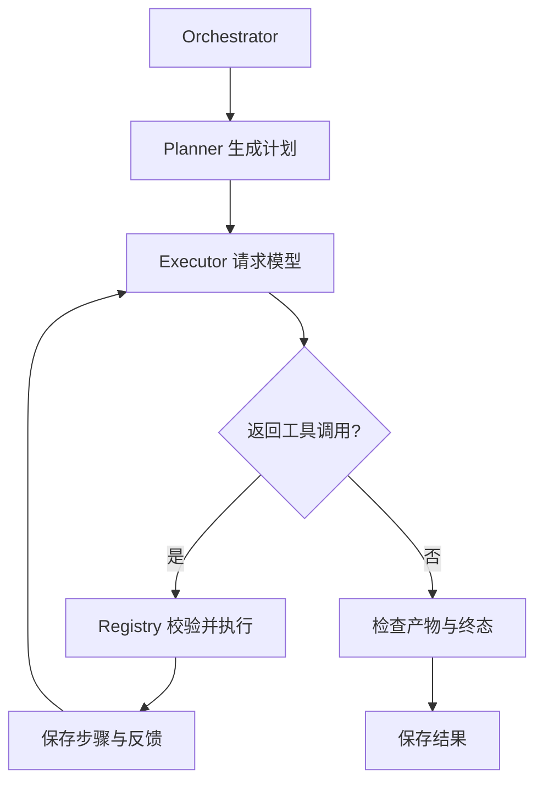

# 从一次任务学完整个 Document Specialist Agent

这是一套单机、单用户学习原型。先学懂“规划—调用工具—保存结果”的主线，再读持久化和可靠性；Memory、Evaluation、MCP 放在最后。无需学习 Redis、向量数据库或多 Agent，就能运行当前版本。

**先区分两个完成标准**：学习所需的功能链路已经补齐；真实 Docker/LLM/S3 的联合验收仍需实际环境，已知超时问题 SEC-001 继续延期。不要把离线示例里的成功率当成真实模型效果。

## 1. 先运行一个不花模型调用费用的例子

Windows PowerShell，在项目根目录执行。已有 `.venv` 可以直接使用，不要覆盖已有 `.env`。

```powershell
# 没有虚拟环境时才执行这一条；建议 Python 3.12 或 3.13
py -3.12 -m venv .venv
.\.venv\Scripts\python.exe -m pip install -r requirements.txt
.\.venv\Scripts\python.exe -m demo.learning_demo
.\.venv\Scripts\python.exe -m evaluation.run
```

Linux/macOS 用 `.venv/bin/python` 替代上述 Python 路径。

例子把 10、20、30 写进 CSV，经过三次工具调用后生成 total=60 的 CSV，再保存任务记录。运行过程中真实使用了状态机、SQLite、执行循环、文件校验和统计模块。模型回复、文件后端和对象存储是固定测试替身，没有在宿主机执行模型生成代码。临时目录在示例退出时删除。

先观察输出中的 `steps`、`artifact` 和 `evaluation`，暂时不必看懂全部代码。需要看真实任务历史时，使用后面的 API 或真实 demo，它们默认保存在 `data/tasks.sqlite3`。

## 2. 第一课：任务和步骤分别是什么

阅读 `task/task_model.py`，只看 Task、TaskStep 和状态转换。

任务是用户的一次请求，例如“生成工资合计报告”。步骤是执行器实际调用一次工具，例如“读取表格”。Planner 的计划是建议，实际步骤由 Executor 根据模型返回的 Tool Calling 创建；二者不要求一一对应。

| 对象 | 状态流转 | 保存的主要信息 |
| --- | --- | --- |
| Task | CREATED → RUNNING → SUCCESS / FAILED | 用户请求、输入、产物要求、结果、错误、metrics |
| TaskStep | PENDING → RUNNING → SUCCESS / FAILED | 工具名、输出、错误、时间、尝试次数 |

CREATED/PENDING 也可直接 FAILED，供启动失败和中断收尾使用。SUCCESS/FAILED 是终态，不能重新 start。新的尝试应创建新的任务，而不是篡改旧任务记录。

动手：打开 `tests/test_task_model.py`，解释为什么不能先 succeed 再 start。你只需掌握类、枚举、字典和方法调用。

## 3. 第二课：三层架构怎样协作

阅读顺序：`agent/orchestrator.py` → `agent/planner.py` → `agent/executor.py`。

Orchestrator 管理一次任务的全过程；Planner 调用模型得到结构化计划；Executor 反复把可用工具告诉模型、执行工具、把结果回传。最后无 tool_calls 的回复被视为最终回答，但如果用户明确要求产物，还必须有通过校验的文件。



一轮回复可以包含多次工具调用。每次调用都有 `tool_call_id`，模型下一轮要收到对应的 tool 消息。调用失败也要反馈，否则模型不知道应该修正什么。

动手：在学习 demo 的固定回复中观察 `call_0`、`call_1`、`call_2`。再看 Executor 何时创建 TaskStep、何时保存 output。

## 4. 第三课：为什么需要 Tool Registry

阅读 `tools/base_tool.py`、`tools/tool_registry.py`，再读一个简单工具 `tools/file_tool.py`。

BaseTool 定义“工具必须有什么”：名字、描述、JSON Schema、execute 方法。Registry 负责注册、权限检查、参数校验和调用分发。Executor 只认识 Registry，不需要为每个工具增加 if/else。

当前工具有 run_python、read_file、save_report、parse_document、read_step_output。新增工具后还要在 `agent/wiring.py` 注册，并在 ALLOWED_TOOLS 配置里启用。权限能力由 required_permissions 声明。

动手：仿照 FileTool 写一个没有外部副作用的工具，例如统计字符串长度，添加测试后再注册。先不要改沙箱执行逻辑。

## 5. 第四课：数据库、异步队列与恢复

阅读 `task/task_manager.py` → `task/sqlite_store.py` → `task/worker.py` → `api/app.py`。

TaskManager 统一修改状态。SQLite 将整个 Task 序列化成 JSON 放在 tasks 表的一行里。BEGIN IMMEDIATE 保护“读取旧状态—修改—写回”，多个 worker 不会领取同一个 CREATED 任务。

POST /tasks 先落盘，马上返回任务 ID。固定数量的 worker 轮询 CREATED 记录并领取执行。TASK_QUEUE_CAPACITY 限制等待与运行任务总数，MAX_CONCURRENT_TASKS 控制每个 API 进程的 worker 数量。队列满时返回 503，不留下额外任务。

正常停止服务时等待正在执行的任务结束；尚未领取的 CREATED 记录下次启动继续执行。突然断电或强杀会留下 RUNNING。为避免重复代码副作用，本版不自动重放：先停止所有 API/worker，再执行：

```powershell
.\.venv\Scripts\python.exe -m task.recover --db data/tasks.sqlite3 --workers-stopped
```

这会把残留任务和未完成步骤标成 FAILED，原因是执行不确定；不会杀死沙箱代码。确认沙箱环境后再新建任务。恢复命令不是沙箱超时缺陷的修复。

动手：看 `test_persistence_in_new_python_process` 和 `test_queue_claim_is_unique`，分别理解“落盘”和“原子领取”。

## 6. 第五课：输入、文档和产物

阅读 `documents/files.py`、`tools/document_tool.py`、`tools/report_tool.py`。

API 接收最多 5 个输入文件，Base64 解码后总大小不超过 2 MiB；只接受文件名，不接受宿主机路径。任务在沙箱中使用 `tasks/<task_id>` 目录，在对象存储中使用 `reports/<task_id>/` 前缀。共享容器中的目录区分用于避免日常任务混文件，不是恶意多租户隔离。

支持 CSV、XLSX、TXT、MD、JSON。CSV/XLSX 返回表头、总行数和前 20 条数据。XLSX 有压缩包展开大小和表格维度限制；不计算 Excel 公式，data_only 读取的是文件中已有缓存值。

save_report 上传前校验非空、格式和表格形状；用户可指定 format、required_columns、min_rows。通过后记录大小、SHA-256、对象 key、下载 URL 和有效期。若要求产物但模型直接说完成，Executor 最多追加两次纠正提示，还受总轮数和工具预算限制。

这些检查能发现空文件和结构错误，不能证明任意业务计算正确。固定评估集会另外检查已知样本的合计值。

动手：把固定数据改为 -10、0、3，结果应为 -7；把 required_columns 改为不存在的列，观察上传前如何拒绝。

## 7. 第六课：可靠性控制

阅读 `retry/retry_policy.py`、`agent/runtime.py` 和 Executor 的 `_invoke_tool`。

| 控制 | 限制什么 | 默认 |
| --- | --- | --- |
| MAX_ITERATIONS | 模型工具循环轮数 | 8 |
| MAX_TOOL_CALLS | 实际工具尝试次数，含重试 | 24 |
| TASK_TIMEOUT_SECONDS | 任务各阶段之间的协作式截止检查 | 300 秒 |
| LLM_TIMEOUT_SECONDS | 单次模型 HTTP 请求等待时间 | 60 秒 |

瞬态故障只有在工具声明 retry_safe 时才自动重试。指数退避增加等待时间，随机抖动避免许多请求同步重试。生成代码和上传工具默认不安全重放。超时或状态不确定必须停止任务，不让模型继续尝试相同副作用。

协作式任务截止时间可以阻止后续调用，但正在阻塞的任意 SDK 调用不一定立刻停止；现有沙箱代码停止缺陷单独见 KNOWN_ISSUES。不要把“任务 FAILED”理解成“进程已被杀死”。

## 8. 第七课：Memory 为什么分两种

阅读 `memory/context.py`、`tools/history_tool.py`、`memory/notes.py`。

短期记忆就是当前任务发给模型的 messages。长工具输出只送前 2000 字符和 step 引用；完整输出在数据库里，可通过 read_step_output 分段读取。上下文超过字符预算时按完整的 assistant/tool 组移除较早历史，保留最初的指令、用户任务和最新结果；仍超限就明确失败。字符预算是易懂的近似，不是精确 token 计算。

长期记忆是用户显式提交的 `memory_note`，成功后才保存。不会自动把原始文档和模型回答放进长期记忆。写入时遮盖常见邮件、URL、token 等；英文词和中文相邻双字用于关键词匹配。正则脱敏不保证识别所有敏感信息，请只填写可复用的方法摘要。

例如 memory_note 可以是“工资 CSV 先核对表头，再按部门汇总”。不应写真实员工资料。`DELETE /memory/<task_id>` 删除该任务长期笔记；历史任务轨迹是另一类记录，不会一起删除。

## 9. 第八课：Evaluation 怎样避免自说自话

阅读 `evaluation/metrics.py`、`evaluation/cases.json`、`evaluation/run.py`。

运行指标来自持久化记录：完成任务成功率、要求产物的任务达标率、工具重试比例、平均任务耗时、模型调用数和供应商返回的 token。供应商未返回 usage 时明确记为未知，不估算成真实消费。

固定评估集包含正数合计、负数/零合计、XLSX 合计三个场景。它验证程序流程和文件内容，模型是固定替身，所以不能得出“真实 LLM 成功率 100%”。可以继续加数据集，再另行接入真实模型做质量评估。

```powershell
.\.venv\Scripts\python.exe -m evaluation.run --output data/evaluation.json
```

## 10. 最后再学 MCP

默认 parse_document 在本地解析，MCP 是可选增强：同一个工具接口，通过标准协议调用独立解析服务。模型不能指定远程服务 URL；URL 由应用配置决定，传输的是受限的文件字节，不是本机任意路径。

```powershell
.\.venv\Scripts\python.exe -m pip install -r requirements-mcp.txt
.\.venv\Scripts\python.exe -m demo.mcp_parser_server
```

在另一个终端启动应用前设置 MCP_PARSER_URL=http://127.0.0.1:8001/mcp。适配器先 initialize/list_tools，再 call_tool；外层有 30 秒等待限制。默认提供的服务只监听 loopback。

本实现固定使用 MCP Python SDK v1 的 API。参考 [官方 Python SDK](https://github.com/modelcontextprotocol/python-sdk)；可选依赖限制 `<2`，不混用 v2 接口。

## 11. 运行真实项目

准备 `.env`、启动 `docker compose up -d`，检查 ALLOWED_TOOLS 包含新增工具，再执行：

```powershell
.\.venv\Scripts\python.exe -m uvicorn api.app:app --host 127.0.0.1 --port 8000
```

用浏览器打开 http://127.0.0.1:8000/docs，可直接在 Swagger 页面调用接口。本版没有登录鉴权，是本机学习服务，不直接暴露到公网。可以先提交无文件的简单任务；有文件请求的例子：

```json
{
  "user_input": "读取 input.csv，计算 amount 合计，保存含 total 列的 CSV 报告",
  "inputs": [{"filename": "input.csv", "content_base64": "YW1vdW50CjEwCjIwCg=="}],
  "artifact_requirements": {"required": true, "format": "csv", "required_columns": ["total"], "min_rows": 1},
  "memory_note": "CSV 合计前先检查表头"
}
```

用返回的 ID 调 GET /tasks/{id}，看状态和 metrics.artifacts。GET /evaluation 查看当前数据库累计指标。

不通过 API 也可以运行 `python -m demo.run_demo`，这会真实调用模型并产生调用费用。`python -m demo.artifact_smoke` 独立验证 Docker/对象存储的 CSV/XLSX、签名访问、匿名拒绝与过期；不包含 SEC-001 超时探针。

## 12. 学完的判断标准

你能不用背代码，解释下面的问题，就已经掌握项目主线：

1. 为什么 Planner 不直接执行代码？Executor 为什么要循环？
2. Task 与 TaskStep 有什么区别？失败步骤为什么不一定让整个任务失败？
3. Tool Schema 在哪里验证？增加工具要改哪些地方？
4. SQLite 为什么要事务？线程锁为什么不够？
5. 同一任务为什么不能自动重复执行？哪些工具可以重试？
6. 模型说完成为什么还要检查文件？预签名 URL 有什么用途？
7. 短期记忆怎样避免打断 tool_call_id 配对？长期记忆保存什么？
8. 离线固定评估与真实模型评估有什么差别？当前已知缺陷是什么？

建议每次只学一课：读主文件 → 运行对应测试 → 改一个小输入 → 用自己的话解释结果。先完成全部课程，再考虑更复杂的技术。
