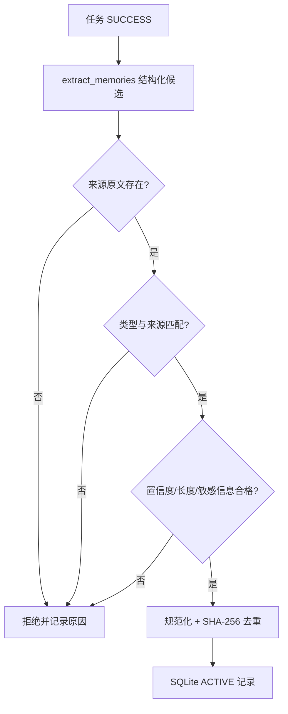
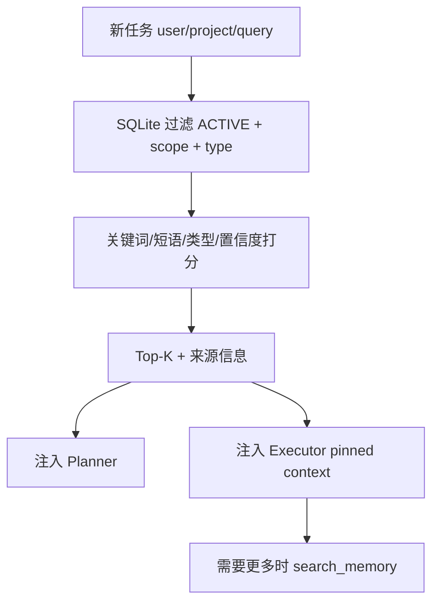

# 11. 本地长期记忆模块

## 1. 它解决什么问题

Task JSON 保存的是“一次任务发生了什么”，上下文消息保存的是“一次 Agent Loop 当前
知道什么”。两者都不会主动把可复用信息带到下一次任务。

长期记忆只保存跨任务仍有价值的少量事实：用户偏好、项目约束、确认过的业务口径和
经过成功执行验证的处理经验。它不是聊天记录备份，也不是把所有工具输出再复制一遍。

## 2. 为什么 P1-1 使用 SQLite，不做向量化

- Python 标准库直接提供 `sqlite3`，本地启动不需要额外服务；
- 单文件可持久化，事务和索引比自行管理 JSON 列表可靠；
- user/project/type/status 过滤与关键词排序容易解释，面试时能讲清每一步；
- 当前数据量小，先验证“什么值得记、如何防止错误记忆”比先引入 Embedding 更重要。

代价是关键词检索不能理解同义词。需要语义召回时可以替换 Store/Search 层，不需要
重写 Orchestrator、写入策略或 `search_memory` 的作用域规则。

## 3. 记忆结构

| 字段 | 作用 |
| --- | --- |
| `id` | 随机逻辑 ID |
| `user_id/project_id` | 本地逻辑作用域 |
| `memory_type` | PREFERENCE / CONSTRAINT / BUSINESS_FACT / PROCEDURE |
| `content` | 注入模型的精炼内容 |
| `content_hash` | 同作用域、同类型去重 |
| `source_task_id` | 能回查产生这条记忆的任务 |
| `source_kind/source_excerpt` | 用户明确表达或执行证据及原文摘录 |
| `confidence` | 候选置信度，低于门槛拒绝 |
| `status` | ACTIVE / INVALIDATED / DELETED |
| 时间字段 | 创建、更新和失效时间 |

## 4. 写入流程

模型只负责把自然语言整理成候选，不拥有数据库写权限。最终是否写入由确定性 Policy
决定。PREFERENCE、CONSTRAINT 必须能在用户原话中找到证据；PROCEDURE 必须能在
成功工具输出或已确认产物记录中找到原文。模型回答和模型自行提交的步骤完成声明本身
都不算验证来源。

## 5. 召回流程

PREFERENCE 和 CONSTRAINT 即使没有关键词重合也有很小的作用域加分，因为它们通常对
整个项目有效；BUSINESS_FACT 和 PROCEDURE 必须与查询存在关键词或短语命中。

注入文本明确声明：记忆是历史证据而不是新指令；当前用户输入冲突时优先当前输入；
每条记忆保留 memory_id、source_task_id、confidence 和更新时间。

## 6. 作用域与安全边界

`search_memory` 的模型 Schema 没有 user_id/project_id。Tool Registry 只注入当前
task_id，工具再从 TaskManager 读取作用域，因此模型不能通过参数搜索其他项目。

这只是本地逻辑隔离，不是账号鉴权。HTTP API 仍依赖统一 `API_TOKEN`；如果未来做真正
多租户，需要从认证身份派生 user_id，而不是相信请求体。

## 7. 生命周期与冲突

- 相同作用域、相同类型、规范化内容相同：返回已有记录，不重复写入；
- 内容过时但需要保留审计：标记 INVALIDATED；
- 用户要求删除：标记 DELETED；
- 只有 ACTIVE 参与召回；
- 新输入与旧记忆冲突：本轮以新输入为准，随后可通过管理 API 失效旧记录。

P1-1 不让模型自动覆盖冲突记忆，因为“两个说法相似但是否冲突”本身可能判断错误。
显式状态变更更容易审计。

## 8. 失败为什么不影响主任务

记忆是增强能力，不是文档任务成功的必要条件。召回失败时按无记忆继续；写入发生在任务
已成功之后，提取或 SQLite 异常只记录 `memory_recall_failed` / 
`memory_capture_failed`，不能把已有产物改成 FAILED。

## 9. 完整调用链

`POST /tasks(user_id, project_id) → Task 落盘 → MemoryService.recall → Planner.plan
→ Executor.run → search_memory（可选）→ 产物验证 → Task SUCCESS →
MemoryExtractor → MemoryPolicy → SQLiteMemoryStore.save`

## 10. 面试回答

项目的长期记忆没有直接上向量数据库，而是先用 SQLite 做了一套可解释的 Harness
闭环。新任务按用户和项目过滤 ACTIVE 记忆，再做关键词 Top-K，把带来源的结果注入
Planner 和 Executor；执行中还能调用 search_memory 二次召回。任务成功后，模型只
负责提取结构化候选，Runtime 会检查证据原文、来源类型、置信度、敏感信息和重复内容，
合格后才写入。这样重点解决的不是“存得多”，而是防止模型推测污染长期上下文，并且
让每条记忆都能追溯到 source_task_id。
