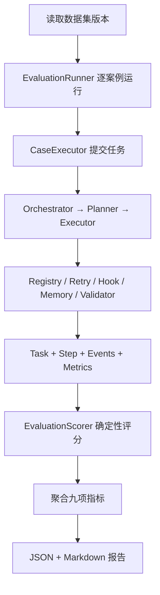

# 12. 独立 Evaluation 模块

## 1. 它解决什么问题

pytest 主要回答“代码是否按断言工作”，但 Agent 项目还要回答另一类问题：面对一组固定
任务，它是否选对工具、完成计划、从失败中恢复，并在可接受的 Token 和时延内交付结果。

P1-2 把这两类验证分开：

| 机制 | 回答的问题 | 输入 | 输出 |
| --- | --- | --- | --- |
| pytest | 某个函数、状态转换或安全边界是否正确 | 测试函数 | passed / failed |
| Evaluation | Agent 在固定任务集上的整体效果如何 | 版本化案例 | 每案例证据 + 聚合指标 + 报告 |

Evaluation 不进入 Agent Loop，也不修改任务结果。它只是提交任务、读取已经存在的执行
轨迹并评分，因此评测故障不会成为生产任务的一部分。

## 2. 模块结构与职责

| 文件 | 单一职责 |
| --- | --- |
| `evaluation/model.py` | 案例、期望、单例结果、聚合指标和报告的数据结构 |
| `evaluation/dataset.py` | 加载并校验版本化 JSON 数据集 |
| `evaluation/runner.py` | 逐案例执行，隔离单例异常，记录端到端时延 |
| `evaluation/scorer.py` | 从 Task 轨迹计算确定性指标 |
| `evaluation/reporter.py` | 输出 JSON 和 Markdown 报告 |
| `evaluation/fake_runtime.py` | 用脚本化模型/工具构建可重复的完整 Harness 调用链 |
| `evaluation/cli.py` | 区分 fake / real 模式并提供外部调用安全门 |
| `evaluation/datasets/harness_v1.json` | 九类固定案例及其期望 |

## 3. 完整调用链



最关键的设计是 D 到 F 与正常任务完全相同。Fake 模式只替代外部不确定性，不绕过
Runtime；Scorer 读取真实 Task 轨迹，而不是相信 Fake LLM 声称“我完成了”。

## 4. 案例是如何描述的

每个案例包含四部分：

1. **任务**：`user_input`、可选输入文件、用户/项目作用域、是否强制产物；
2. **类别**：用于确认固定任务集覆盖了哪些能力；
3. **期望**：最终状态、工具调用顺序、必须完成的计划步骤、是否需要重规划、失败恢复、
   产物校验以及必须出现的事件；
4. **Fake 脚本**：初始计划、可选重规划、工具结果和模型响应，仅供确定性回归。

数据集本身有 `id + version`。修改任务、期望或评分含义时要提升版本，避免把两次不同
试卷的分数直接比较。

P1-2 固定九类案例：

| 类别 | 重点观察 |
| --- | --- |
| 文档解析 | 是否选择 `parse_document` 并完成解析步骤 |
| 结构化数据统计 | 是否选择 `run_python` 得到确定性统计 |
| 产物生成 | 是否调用保存工具且产物校验通过 |
| 缺失数据 | 是否承认数据缺失并局部调整计划，不编造结果 |
| 工具参数错误 | Schema 拒绝后能否修正参数继续执行 |
| 工具瞬态故障 | retry-safe 工具能否有限重试后恢复 |
| 大型工具输出 | 是否卸载完整结果并按引用分页回读 |
| 局部重规划 | 不可恢复失败后是否只替换未完成计划 |
| 记忆召回 | 是否在同一作用域召回带来源的长期记忆 |

## 5. 九项指标如何计算

所有指标都来自项目已有轨迹，不新增一套隐藏日志。

| 指标 | 计算来源与定义 |
| --- | --- |
| 任务完成率 | `status == SUCCESS` 的案例数 / 总案例数 |
| 工具选择正确率 | 期望工具序列与实际 `TaskStep.tool` 按位置匹配数 / 两序列最大长度 |
| 计划步骤完成率 | 期望步骤中出现在 `plan_step_completed` 的比例 |
| 产物校验通过率 | 需要产物的案例中，最终发布的每个产物都有最新 `artifact_check.ok=true` 的比例 |
| 平均 Tool Call | 每案例 `Task.steps` 数量的平均值；控制调用不冒充真实工具 |
| 平均重规划次数 | 每案例 `plan_replanned` 事件数的平均值 |
| 失败恢复率 | 标记为恢复案例中，观察到失败/重试且最终 SUCCESS 的比例 |
| 平均 Token | 每案例全部 `llm_events.total_tokens` 之和再取平均 |
| P95 时延 | 每案例端到端运行时间按 nearest-rank 取第 95 百分位 |

报告额外保留 `case_pass_rate`。它要求该案例的状态、工具序列、步骤、重规划、恢复和事件
约束全部成立，适合快速判断“这次改动是否破坏了固定能力”。

### 为什么工具选择使用序列，而不是集合

集合只能知道“调用过哪些工具”。如果 Agent 先调用了错误工具，再调用正确工具，集合仍
可能与期望相同。按顺序比较既惩罚漏调，也惩罚多调和顺序错误，更符合 Agent Loop 的
实际成本。

### 为什么 P95 使用 nearest-rank

案例数较少时，插值算法会得到一个没有真实发生过的时延。nearest-rank 直接返回观测值，
定义简单、可手算、跨 Python 版本稳定。九案例时 P95 实际上就是最慢案例，因此当前更
适合发现离群慢任务，而不是声称具有生产统计显著性。

## 6. Fake LLM 与真实模型如何分工

### Fake 模式

```powershell
.venv\Scripts\python.exe -m evaluation --mode fake
```

脚本化 Planner、LLM 和 Tool 提供确定性输入，但调用仍经过真实 Orchestrator、Executor、
Registry、重试、AfterToolCall、TaskManager、Memory 与 ArtifactValidator。它适合：

- 回归 Agent Loop 控制流；
- 精确复现参数错误、瞬态故障和重规划；
- 在没有 API Key、Docker 和 MinIO 时运行；
- 比较代码改动前后的轨迹指标。

Fake 模式高分只能说明 Harness 行为可重复，不能证明真实模型理解能力强。

### Real 模式

```powershell
.venv\Scripts\python.exe -m evaluation --mode real --allow-external `
  --prompt-version harness-prompts-v1
```

真实模式使用 `agent.wiring.build_orchestrator`，会读取 `.env` 并可能调用模型、Sandbox、
MinIO。因此 CLI 要求显式 `--allow-external`。运行前必须准备数据集声明的对象存储输入。

真实报告固定保存：

- `mode`；
- `model`；
- `prompt_version`；
- `dataset_id/dataset_version`；
- 开始、结束时间与 run_id。

只有这些版本信息相同，或者变更被明确记录，两次结果才适合比较。

## 7. 报告为什么同时输出 JSON 和 Markdown

- JSON 给程序或后续 CI 读取，可以做阈值判断、趋势分析；
- Markdown 给人查看，包含总指标、案例表和失败检查；
- 每次报告带随机 run_id，不覆盖历史运行；
- 报告写入 `.data/evaluation/reports`，属于本地运行数据，不提交到 Git。

## 8. 最容易误解的地方

1. **Evaluation 不是 pytest 的替代品**：代码正确和 Agent 有效都要验证；
2. **Fake LLM 不是绕过 Agent**：它只控制模型输出，Runtime 调用链仍然真实；
3. **Tool Call 数不包含控制调用**：`complete_plan_step` 和 `request_replan` 不是 Registry
   工具，不具备外部能力，所以不计入 `Task.steps`；
4. **Token 是 usage 聚合，不是费用**：价格换算属于 P1-3；
5. **任务成功不等于案例通过**：成功但选错工具、漏掉产物校验，案例仍会失败；
6. **当前没有 LLM-as-a-Judge**：没有用另一个模型判断答案文风或语义质量，避免先引入
   额外成本和评委漂移。

## 9. 新增案例的正确流程

1. 在数据集增加唯一 case id、类别、用户目标和可观察期望；
2. 只把业务成功标准写进 expectation，不把内部实现细节全部锁死；
3. 为 Fake 模式声明最小计划、响应和工具结果；
4. 默认让每个 case 使用独立 project scope；记忆案例若需要前置记忆，明确准备其 scope；
5. 确保异常案例真的产生失败证据，而不是直接脚本化成功；
6. 提升 dataset version；
7. 先跑 Fake 评测确认控制流，再按需准备真实输入运行 Real 模式；
8. 比较报告时同时核对模型、Prompt 和数据集版本。

## 10. 面试回答

我把测试和 Agent Evaluation 分开建设。pytest 负责验证状态机、Schema 和安全边界等代码
正确性；Evaluation 则维护一套版本化任务集，通过正常 Orchestrator 入口运行，再从
TaskStep、plan_events、重试、校验和 LLM usage 轨迹计算任务完成率、工具选择正确率、
步骤完成率、失败恢复率、Token 和 P95 时延。Fake LLM 用来做确定性回归，真实模型评测
必须显式开启，并在报告里固定模型、Prompt 和数据集版本。这样可以区分“程序没坏”和
“Agent 确实有效”，并且每个分数都能追溯到执行证据。

## 11. 我必须真正掌握的代码

- `EvaluationCase/EvaluationExpectation`：定义试题和成功标准；
- `OrchestratorCaseExecutor`：证明评测复用生产调用入口；
- `EvaluationScorer.score_case`：把原始轨迹变成单案例证据；
- `EvaluationScorer.aggregate`：九项指标如何聚合；
- `FakeCaseExecutor`：哪些部分是 Fake，哪些 Runtime 仍然真实；
- `EvaluationReporter`：版本元数据和失败检查如何留存。

JSON 解析、`argparse` 参数写法、Markdown 拼接属于工程细节，可以会用而不必背诵。
