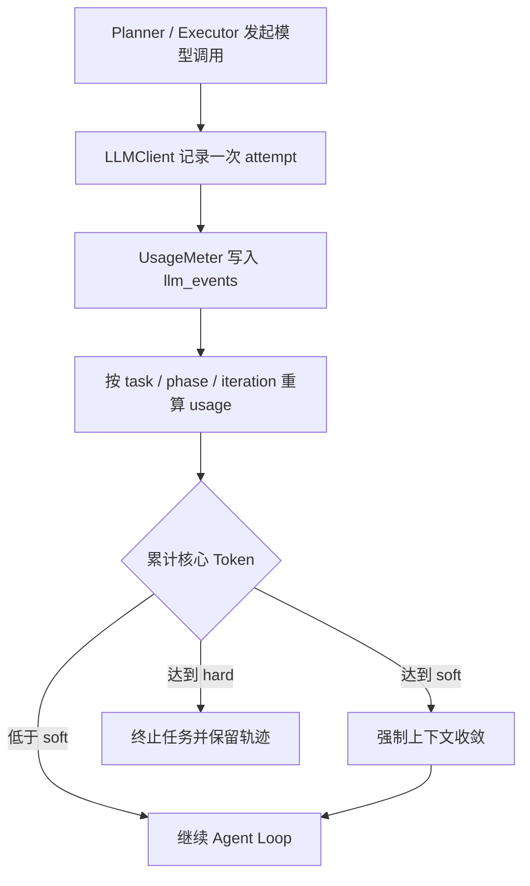

# 13. Token、时延、成本计量与累计预算

## 1. 它解决什么问题

Agent 的一次任务不是一次模型请求。规划、执行循环、上下文压缩、局部重规划和记忆提取
都可能调用模型；同一阶段还可能因为瞬态故障重试。如果只看最后一次响应的 Token，就
无法回答三个关键问题：

1. 这个任务总共用了多少模型资源；
2. 资源消耗集中在哪个阶段、哪一轮；
3. 长任务何时应该主动收敛，何时必须停止。

P1-3 增加一个独立计量层。它不参与模型决策，也不替换原始日志；它将已有的 LLM 事件
转换为可解释的资源快照，并把累计 Token 变成 Runtime 可执行的预算规则。

## 2. 模块职责

| 文件 | 单一职责 |
| --- | --- |
| `agent/llm_client.py` | 从 provider 响应规范化模型名、四类 Token、单次时延和重试状态 |
| `metering/pricing.py` | 保存带版本的模型价格表，计算普通输入、缓存输入和输出的估算费用 |
| `metering/meter.py` | 追加原始事件，派生 task / phase / iteration 三层聚合快照 |
| `metering/budget.py` | 根据累计核心 Token 产生 soft 收敛或 hard 终止决定 |
| `context/manager.py` | 接收 soft 信号，强制进入已有上下文收敛路径 |
| `agent/orchestrator.py` | 计量初始规划和任务成功后的记忆提取，规划后检查 hard budget |
| `agent/executor.py` | 计量执行、压缩、重规划，并在每次核心模型响应后检查 hard budget |
| `task/task_manager.py` | `llm_events` 追加写；`usage` 派生快照覆盖写 |

## 3. 完整计量链路



这里有意保留两层数据：

- `metrics.llm_events` 是追加式事实，记录每次尝试；
- `metrics.usage` 是可重算快照，方便 API 和 Evaluation 直接读取。

如果价格表或聚合逻辑以后升级，可以从原始事件重新生成 usage，不必篡改历史事件。

## 4. 一次 LLM 事件记录什么

每次 SDK 请求尝试都会产生事件：

| 字段 | 含义 |
| --- | --- |
| `model` | 成功时优先采用 provider 响应中的实际模型；失败时使用请求模型 |
| `attempt` | 这次 chat 调用内部的第几次尝试 |
| `final_status` | `RETRYING`、`FAILED` 或 `SUCCESS` |
| `duration_ms` | 当前尝试耗时，不是整个任务端到端时延 |
| `prompt_tokens` | 输入 Token |
| `completion_tokens` | 输出 Token |
| `total_tokens` | 总 Token；provider 缺失时由输入加输出得到 |
| `cache_tokens` | 输入中命中缓存的 Token，统一不同 provider 字段名 |
| `phase` | plan / replan / context_compaction / execute / memory_capture |
| `iteration` | Executor 当前轮次；只有有轮次含义的阶段才存在 |

缓存字段兼容两种常见返回方式：

- OpenAI 风格：`prompt_tokens_details.cached_tokens`；
- DeepSeek 风格：`prompt_cache_hit_tokens`。

Runtime 不会根据文本长度伪造 provider usage。成功响应没有 usage 时，快照增加
`usage_missing_responses`，对应费用变为 `null`。

## 5. 三层聚合为什么这样设计

一个任务快照的核心结构如下：

```json
{
  "cost_kind": "estimate_not_provider_bill",
  "pricing_version": "provider-contract-2026-09",
  "models": ["model-a"],
  "budgeted_total_tokens": 1620,
  "task": {"total_tokens": 1620, "estimated_cost_usd": 0.003},
  "by_phase": {"plan": {}, "execute": {}},
  "by_iteration": {"execute:1": {}}
}
```

- task 层回答“这个任务总体花了多少”；
- phase 层回答“规划、执行、压缩还是重规划最贵”；
- iteration 层回答“哪一轮开始发散”。

iteration 使用 `phase:iteration`，而不是只用数字。因为 execute 第 1 轮和
context_compaction 第 1 轮是不同工作，不能混合。

失败重试没有成功 usage 时，只增加 attempts、failed_attempts 和 duration_ms，不增加
Token；成功响应缺 usage 则显式记录缺口，避免观测数据看起来比实际更精确。

## 6. 成本如何估算

设：

- 输入 Token 为 $P$；
- 缓存命中 Token 为 $C$；
- 输出 Token 为 $O$；
- 三档每百万 Token 单价分别为 $R_i$、$R_c$、$R_o$。

则本地估算为：

$$
\text{cost} = \frac{(P-C)R_i + CR_c + OR_o}{1{,}000{,}000}
$$

代码不会内置一个号称“永远正确”的供应商价格。用户必须同时配置：

- `LLM_PRICING_VERSION`；
- `LLM_INPUT_PRICE_USD_PER_MILLION`；
- `LLM_CACHED_INPUT_PRICE_USD_PER_MILLION`；
- `LLM_OUTPUT_PRICE_USD_PER_MILLION`。

四项全空时，Token 继续统计，费用为 `null`；只填一部分则启动配置校验失败。未知模型
同样返回 `null` 并写入 `unpriced_models`，不能把“未知”误写成零成本。

`estimated_cost_usd` 不是供应商最终账单。供应商可能有请求级舍入、峰谷价格、批处理
折扣、隐藏推理 Token 或合同价；`pricing_version` 的作用是说明“这次估算依据哪张表”。

## 7. soft budget 和 hard budget 的执行流程

核心预算统计以下阶段：

- plan；
- replan；
- context_compaction；
- execute。

`memory_capture` 发生在业务任务成功后，仍计入 task 总用量和成本，但不消耗已经结束的
核心 Agent Loop 预算。

### soft budget

每轮 Executor 调用模型前，BudgetController 读取持久化的
`usage.budgeted_total_tokens`。达到 soft budget 后：

1. 只记录一次 `token_soft_budget_reached`；
2. 向 ContextManager 传入 `force_compaction=True`；
3. ContextManager 记录 `context_budget_forced`；
4. 有较早完整消息组时执行摘要压缩，否则保留 pinned 和 recent 组；
5. Agent 继续执行。

soft 是收敛信号，不是删除最新上下文的命令。没有可安全压缩的历史时，Runtime 宁可保留
最近完整消息组，也不会拆开 tool call / tool result 或删除系统约束。

### hard budget

规划、压缩、执行和重规划响应写入 usage 后立刻重新检查。达到 hard budget 后：

1. 只记录一次 `token_hard_budget_exceeded`；
2. 抛出 `TokenBudgetExceededError`；
3. 越界响应不再进入工具调度或最终答案发布；
4. Orchestrator 将仍处于 RUNNING 的任务标记为 FAILED；
5. 已写入的 LLM、usage 和 budget 轨迹保留用于定位。

hard budget 基于 provider 返回的实际 usage，因此是“响应后硬停止”：它能拒绝首次越界
响应并阻止后续调用，但无法在请求发出前精确知道该请求将生成多少 Token。这是当前原型
必须诚实说明的边界。

## 8. 与上下文窗口预算的区别

| 预算 | 观察对象 | 目标 |
| --- | --- | --- |
| Context soft/hard/target | 下一次请求的输入上下文大小 | 防止单次请求撑爆模型窗口 |
| Task soft/hard | 整个核心 Agent Loop 已实际消耗的累计 Token | 控制长任务的总资源消耗 |

两者不能互相替代。一个任务每次上下文都未超窗口，但循环很多次，累计成本仍可能失控；
反过来，一个刚开始的任务也可能因为单次输入过大而触发 Context hard limit。

## 9. 故障与边界

1. **事件 sink 失败**：LLMClient 不让观测故障破坏模型请求；这意味着极端情况下 usage
   可能缺一条，验收时应检查 `llm_events` 与 provider 记录；
2. **provider 不返回 usage**：记录缺失，不用字符估算冒充计费 Token；
3. **价格未配置或模型未知**：费用为 `null`；
4. **重试时延**：每个失败 attempt 的时延会聚合，便于看出“慢在重试”；
5. **任务端到端时延**：仍由 Evaluation Runner 单独测量；LLM duration 只代表模型层；
6. **并发更新**：当前 TaskManager 是单进程锁保护；未来多进程部署要把事件追加和快照
   更新迁移到支持事务的共享存储。

## 10. 面试回答

我没有把 Token 统计散落在 Planner 和 Executor，而是让所有模型调用先输出统一事件，再由
UsageMeter 从追加式事件聚合 task、phase 和 iteration 三层指标。缓存输入、普通输入和
输出按带版本的本地价格表分别估价；价格缺失就返回 null，明确不是供应商账单。Runtime
再用累计核心 Token 做两级控制：soft budget 复用上下文治理触发收敛，hard budget 在每次
核心模型响应后终止任务并保留失败轨迹。这样既能定位哪一阶段耗费最大，也能避免 Agent
在多轮循环中无限消耗资源。

## 11. 我必须真正掌握的代码

- `LLMClient._usage_fields`：不同 provider usage 如何规范化；
- `UsageMeter.event_sink/aggregate`：事实事件如何变成三层快照；
- `ModelPrice.estimate`：缓存与非缓存输入为什么分开；
- `BudgetController._evaluate`：soft 与 hard 的边界；
- `Executor.run`：预算检查发生在上下文准备前、压缩后和模型响应后的位置；
- `ContextManager.prepare(force_compaction=True)`：soft 信号如何复用现有治理链路。

Decimal、dataclass 和环境变量解析属于实现细节，可以会用而不必背诵。
