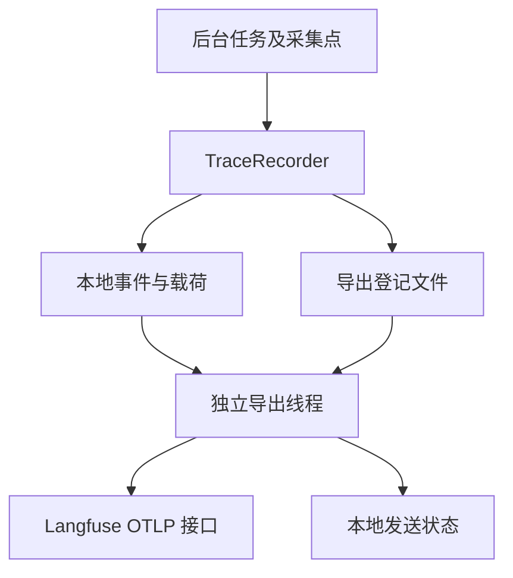

# T4：Langfuse 接入与学习说明

本轮实现完成、未运行测试、未连接真实 Langfuse。T5 完整链路验收另行进行。

## 1. 解决什么问题

T0～T3 已把执行过程保存在本地，T4 将这些记录转换成 Langfuse 可以显示的操作树。
业务线程只写本地文件，API lifespan 启动的独立线程负责网络发送；服务不可用不改变业务结果。
当前接入选择 OTLP/HTTP JSON，无新增 SDK 依赖。官方通常推荐 Python SDK；本项目已有
完整持久化事件和稳定 ID，使用官方 OTLP 协议便于回放原时间和父子关系，避免再次自动埋点。

## 2. 调用链和映射



| 本地数据 | Langfuse 表示 |
|---|---|
| trace_id | 所有操作共同的 OTEL traceId |
| observation_id / parent_id | spanId / parentSpanId |
| 根 task 操作 | 根 Span，包含总体输入和服务端交付 |
| generation | Generation，含消息、模型、参数、usage、估算费用 |
| tool | Tool 类型操作（OTEL Span） |
| 普通 span | 计划、输入装载、压缩、校验等 Span |
| task_id、代码版本 | 每个操作传播 task_id metadata 和 release |
| prompt_version、request_hash | 本地模板标签和请求哈希 metadata |

本地 Prompt 标签不是 Langfuse Prompt Management 的数字版本，不伪造云端 Prompt 关联。
cache_tokens 保留在 metadata，避免将已包含在 input 中的缓存 Token 再次累计。
没有配置本地单价时不发送自定义 cost；Langfuse 可能自行估价，与供应商账单仍不同。

每个 observation 只在 ended 事件存在后发送一次完整 Span。根操作在后台任务结束后才发送，
因此任务运行中可能暂时只看到子操作，根结束后树才完整。API POST 返回任务 ID 不结束根。
原有 ContextVar 在 worker 内绑定/清理；导出线程直接使用落盘 ID，不依赖线程上下文传播。

## 3. 持久化导出状态

每条新任务在 LANGFUSE_ENABLED=true 时登记 `.data/traces/<trace_id>/langfuse.json`。
开启功能不会自动上传未登记的历史 Trace。关闭开关暂停发送，重新开启会继续同目标的已登记任务。
目标地址与 public key 的哈希绑定发送凭据；换项目后不混用旧回执，查询返回 destination_matches=false。
当前不提供跨项目迁移或历史任务批量补传，避免误上传；请在新项目运行新任务。

状态按 observation 保存：

| 状态 | 含义及处理 |
|---|---|
| sending | 网络请求前已持久化发送意图；重启发现它则转 uncertain |
| accepted | 端点已接收，后续扫描跳过；不等于已完成 UI 索引 |
| retry | 429 明确拒绝，指数退避，最大等待 300 秒，默认最多 5 次 |
| exhausted | 自动尝试已用尽，人工检查后决定 |
| rejected | 非 408 的 4xx 或本地总包大小超过 2MB，人工处理配置/大小 |
| uncertain | 超时、连接异常、5xx、重定向、部分接收或响应不可解析，暂停自动重发 |

官方 v4 文档明确同 ID 重复发送不保证去重。因此不能声称“稳定 ID 就能 exactly-once”。
本实现优先避免重复计费统计：明确限流可自动重试，结果不确定需要核对。
如果远端接收后本地回执写入失败，磁盘保留 sending，下一次同样进入 uncertain。
进程退出时最多等待一个网络超时；未发操作仍在磁盘，下次启动继续。
不会自动关闭因业务进程崩溃而仍打开的操作；T1 的显式 interrupt 确认 worker 已死后才可使用。

## 4. 脱敏和大内容

- 默认关闭导出；开启表示允许向所配置的 Langfuse 项目发送新任务的 Prompt、代码和输出。
- 本地基础脱敏后，导出再次执行基础脱敏与 LANGFUSE_REDACT_KEYS 结构化键脱敏；项目密钥文本也移除。
- 默认额外隐藏 email、phone 字段，可根据文档数据增加键名；不是通用 PII 检测器，自由文本需自行判断。
- 默认每个 payload 最大 128000 字节；较小引用校验哈希后展开，较大引用只发送受控引用、大小和哈希。
- 超限 inline 标明省略，可从本地 Trace 查询；不截断伪装成完整内容，不上传文件二进制或签名下载凭证。
- 接口沿用 X-API-Token；Langfuse 本身不获得本地 API Token，不会自动访问本地引用。
- HTTPS 或 loopback HTTP；拒绝 URL 内嵌凭证、路径、查询参数，禁止认证请求重定向。

## 5. 你需要做什么

1. 在你选用的 Langfuse Cloud 或已有自部署实例中创建项目，从项目设置生成 Public Key 与 Secret Key。
2. 在项目本地 `.env` 配置下列内容。密钥只填本地，不发聊天、不提交 Git。

```dotenv
TRACE_ENABLED=true
LANGFUSE_ENABLED=true
LANGFUSE_BASE_URL=https://cloud.langfuse.com
LANGFUSE_PUBLIC_KEY=填写项目PublicKey
LANGFUSE_SECRET_KEY=填写项目SecretKey
LANGFUSE_ENVIRONMENT=development
LANGFUSE_REDACT_KEYS=["email","phone"]
```

BASE_URL 必须与项目区域/部署匹配，以上只是 EU 地址示例；使用你实例提供的实际地址。
本轮不替你注册账户、创建外部项目或部署 Langfuse。没有密钥时业务仍能启动，本地采集继续，
导出状态会说明 missing_project_keys。单进程 API 启动方式沿用 README。

3. 重启 API（使用 lifespan；直接调用 build_orchestrator 不会启动导出线程），提交一条不含敏感数据的新任务。
4. 查询 `GET /tasks/{task_id}/trace` 获取 manifest.trace_id，再查 `GET /tasks/{task_id}/trace/export`。
5. 在 Langfuse 按 Trace ID 或 metadata.task_id 查找，核对 Generation、工具参数、输出、根交付和时间。

## 6. 人工处理不确定发送

先用 trace_id + observation_id 在 Langfuse 确认是否存在；缺少 UI 显示可能只是索引延迟。
确实已收到：调用下面接口，body 为 `{"decision":"accepted"}`，只标记本地回执，不再发送。
确认可重发：body 为 `{"decision":"retry"}`；明确接受远端结果不确定时可能重复的风险。

```http
POST /tasks/{task_id}/trace/export/{observation_id}/resolve
X-API-Token: <本地API_TOKEN，如启用>
Content-Type: application/json

{"decision":"retry"}
```

只允许 uncertain/rejected/exhausted 状态操作，重新计数；修正密钥 Secret 部分可重启后再重试。
若更换 public key 或地址则视为新目标，拒绝混用；请创建新任务验证新项目。

## 7. 边界与验收

仅支持同一 TraceStore 单进程部署（与现有文件任务存储一致），不支持多个 Uvicorn worker。
轮询会扫描目录，适合当前本地原型；大量历史任务需要后续索引/清理策略。
只验证“记录与传输是否正确”，不评价 Agent 的业务答案；没有读取模型隐藏思维。
本轮没有运行单元测试、真实网络联调或 T5 完整验收，不能宣称 Langfuse 已成功收到数据。

官方参考：
- https://langfuse.com/integrations/native/opentelemetry
- https://langfuse.com/integrations/native/opentelemetry/migration-to-v4
- https://langfuse.com/docs/api-and-data-platform/features/public-api
