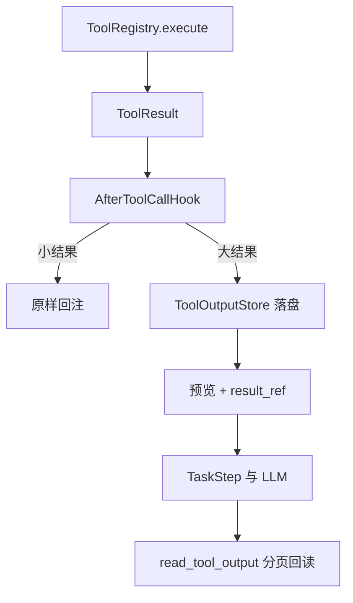

# P0-3 工具大结果卸载与二次回读：验收说明

> 实现分支：`feat/harness-p0-3`
>
> 开发基线：`feat/harness-p0-2` / `66cf8d1`
>
> 当前状态：代码实现完成，未执行测试；以下测试交由独立 Codex 验收。

## 1. 本编号解决的问题

原 Executor 会把 `ToolResult.to_text()` 原样追加到 `role=tool` 消息，同时把成功
结果完整保存到 `TaskStep.output`。读取长文档或执行产生大量 stdout 时，同一份大
结果会同时扩大模型上下文和任务 JSON。

P0-3 在工具执行与结果消费之间加入统一后处理边界：



这一步只做字符级大结果治理。Token 估算、历史消息压缩和压缩失败熔断属于 P0-4。

## 2. 关键契约

| 契约 | 实现 |
| --- | --- |
| 所有真实工具统一后处理 | Executor 在步骤落盘和 `role=tool` 回注前调用 `AfterToolCallHook` |
| 小结果不改变语义 | 未超过阈值时保留原 `ToolResult.to_text()` |
| 大结果不进上下文 | 完整正文写本地 Store，消息只含有界 preview 与引用信息 |
| 引用不可作为路径使用 | 只接受 `out_` + 32 位十六进制随机 ID |
| 引用绑定任务 | 文件位于 task 命名空间；回读的 task_id 由 Registry 注入 |
| 重启后可读 | Store 是本地持久化目录，不依赖进程内索引 |
| 回读有预算 | JSON Schema 与 Store 同时限制 `limit` |
| TaskStep 不复制大正文 | 保存预览、result_ref、size/content_type/truncated |
| 后处理失败不泄漏正文 | 步骤以稳定错误失败，原始结果不回注、不写 Task JSON |

## 3. 请 Codex 实现并执行的验收测试

建议新增三个聚焦测试文件，不需要 Docker、MinIO 或真实模型。

### 3.1 `tests/test_tool_output_store.py`

1. `put` 返回符合 `^out_[0-9a-f]{32}$` 的引用，并在新建 Store 实例后按相同
   `task_id + result_ref` 继续分页读取，证明进程重启不依赖内存索引。
2. `offset=0, limit=固定值` 返回准确切片、`next_offset`、`total_chars` 与
   `size_bytes`；末页的 `next_offset` 为 `None`。
3. `limit > max_read_chars`、负 offset、布尔型 offset/limit 均被拒绝。
4. 使用任务 A 的引用从任务 B 读取，返回 `result_ref_not_available_for_task`。
5. `../x`、绝对路径、带斜杠引用、伪造后缀及非法 task_id 均被拒绝，且不得在
   Store 根目录之外创建或读取文件。
6. 人工篡改记录内的 `task_id` 或 `result_ref` 后，读取必须被拒绝。

### 3.2 `tests/test_tool_output_hook.py`

1. 小于等于 inline 阈值的成功结果原样返回，不生成 `result_ref` 和结果文件。
2. 小错误仍保持 `[tool error] ...` 的模型观察，TaskStep 使用原错误文本。
3. 大成功结果只在 preview 出现前 N 个字符；`model_text` 和 `task_text` 均不含
   preview 之外的唯一尾部标记，Store 回读能得到完整正文。
4. 大错误也必须卸载；观察包含 `status=error`，完整错误只能从 Store 读取。
5. UTF-8 文本的 `size_bytes` 按编码后字节数计算，`total_chars` 按 Python 字符数
   计算，分页拼接后与原文完全一致。

### 3.3 `tests/test_tool_output_integration.py`

1. 用 Fake LLM + 返回唯一长字符串的 Fake Tool 运行两轮 Executor；检查第二轮
   发送给 LLM 的完整 `messages`：包含 preview 和 result_ref，但绝不包含唯一尾部。
2. 检查对应 TaskStep：`result_truncated=True`，四个引用元数据字段正确，
   `output` 不含完整正文；旧格式 TaskStep JSON 仍能反序列化，新增字段使用默认值。
3. Fake LLM 第二轮调用 `read_tool_output`，验证 Registry 自动注入当前 task_id，
   工具 schema 不暴露 task_id，且单次正文长度不超过配置上限。
4. 直接调用 Registry 的 `read_tool_output` 而不传 task_id，返回
   `PERMISSION_DENIED/task_context_required`；用其他 task_id 返回权限拒绝。
5. 让 Store 写入失败，验证步骤变为 FAILED、错误为
   `tool_output_processing_failed`，LLM 不收到原始长结果。
6. 大型失败结果的 `plan_step_failed` 事件与 `retry_events.error_message` 均不得保存
   完整错误尾部。
7. 校验 Settings 默认白名单包含 `read_tool_output` 与 `tool_output.read`，并拒绝
   `read_max_chars > inline_chars / 2` 的配置。

## 4. 建议执行命令

先只跑 P0-3 新增用例：

```bash
python -m pytest -q \
  tests/test_tool_output_store.py \
  tests/test_tool_output_hook.py \
  tests/test_tool_output_integration.py
```

通过后再跑完整离线回归：

```bash
python -m pytest -q
```

验收报告请至少返回：分支、commit SHA、Python/pytest 版本、新增用例数量、聚焦测试
结果、全量结果、失败堆栈，以及 `git status --short`。本编号不要求启动 Docker、
MinIO 或调用真实 LLM。

## 5. 不应在验收中顺手扩展的内容

- 不加入 Tokenizer 或消息摘要；
- 不把 Store 改成 PostgreSQL、向量数据库或对象存储；
- 不新增 MCP；
- 不修改 P0-2 的计划完成与局部重规划语义；
- 不为让测试通过而放宽跨任务和引用格式检查。
