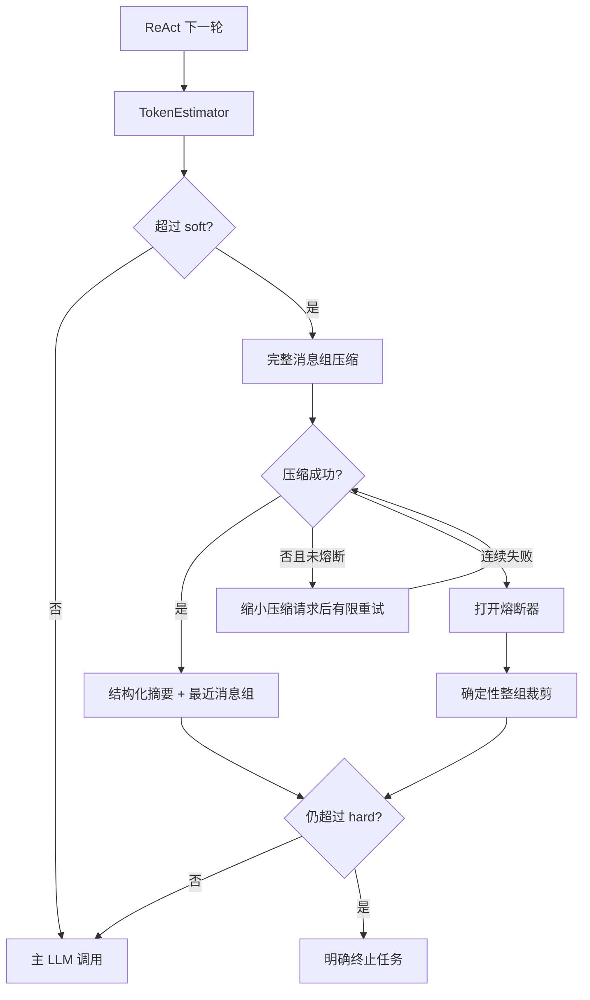

# P0-4 上下文预算、完整消息组压缩与熔断：验收说明

> 实现分支：`feat/harness-p0-4`
>
> 开发基线：`feat/harness-p0-3` / `03e89fc`
>
> 当前状态：代码实现完成，未执行测试；以下测试交由独立 Codex 验收。

## 1. 调用链



## 2. 不变量

1. System Prompt、初始用户目标/计划和可选 repair hint 是 pinned messages。
2. 带 tool calls 的 assistant 消息与全部对应 tool results 是一个原子组。
3. 摘要必须是结构化 Schema，原始目标和活动计划由 Runtime 覆盖，而非信任模型。
4. `result_ref` 只能合并、不能因摘要或确定性裁剪丢失。
5. 压缩调用次数、请求缩减次数和连续失败次数都有上限。
6. hard limit 是输入上限；`hard + output reserve <= model window`。
7. 每次 ContextSession 只属于一个 Executor.run，任务之间不共享熔断状态。

## 3. 请 Codex 实现并执行的验收测试

### 3.1 `tests/test_token_estimator.py`

1. 禁用 tokenizer 时，中英文混合内容走 `character_fallback`，工具 Schema 也计入。
2. 注入 fake tokenizer 时优先返回 `method=tokenizer`。
3. 调用 `observe_actual(..., prompt_tokens)` 后，后续估算改为
   `calibrated_usage`；非法、零值和明显失真的 usage 不污染校准。
4. LLMClient 的成功事件在 response 带 usage 时保存
   `prompt_tokens/completion_tokens/total_tokens`，无 usage 时保持兼容。

### 3.2 `tests/test_message_groups.py`

1. 一个 assistant 发出多个 tool calls，后续对应多个 tool results 时只能形成一个组。
2. 普通 assistant 消息可以形成单消息组。
3. 孤立 tool result、缺少 result、未知 call id、tool_call_id 缺失均抛
   `ContextIntegrityError`。
4. flatten 后合法历史与原顺序完全一致。

### 3.3 `tests/test_context_compactor.py`

1. Fake LLM 返回合法 `compact_context` Tool Call，验证 Schema 解析。
2. 模型故意改写 goal/active_plan 时，最终摘要仍使用 Runtime 传入值。
3. 模型遗漏某个 `result_ref` 时，Runtime 从原始完整组提取并补回。
4. 第一次压缩抛超长/非法响应后，第二次请求必须少一个最早完整组；总调用不超过
   `max_attempts`，并产生 retry 事件。
5. 所有尝试失败后抛 `ContextCompactionError`，不得递归调用。
6. 已有摘要参与下一次压缩，完成/未完成步骤被去重合并。

### 3.4 `tests/test_context_manager.py`

1. 未达到 soft limit：不调用 compactor，消息保持不变，记录 estimate/final 事件。
2. 达到 soft limit：只压缩较早完整组，保留 pinned messages 和最近组，并降到目标区间。
3. 压缩前后检查每个 tool_call_id 恰好有一个对应 result，不能出现半组。
4. 第一次完整压缩失败且仍低于 hard：本轮允许保留，下一轮继续尝试；连续达到阈值
   后打开 circuit。
5. circuit 打开后不再调用压缩模型，只按完整组确定性裁剪。
6. 确定性摘要仍包含 goal、active_plan、unfinished_work 和所有被移除组的 result_ref。
7. 所有可移除组都删掉后仍超过 hard limit，抛出包含
   `context_hard_limit_exceeded` 的 `ContextHardLimitError`。
8. 两个 ContextSession 的失败计数和 circuit 状态互不影响。
9. 已有摘要在 replan 后刷新 active_plan 与完成/未完成步骤。

### 3.5 `tests/test_executor_context.py`

1. Fake Executor 多轮 Tool Calling：每次主 LLM 调用前均经过 ContextManager。
2. 压缩使用的 LLM 事件 phase 为 `context_compaction`，主调用为 `execute`。
3. response usage 触发 `context_usage_calibrated`；后续 `context_estimated.method`
   为 `calibrated_usage`。
4. P0-3 大结果卸载后产生 `context_output_offloaded`，事件包含 result_ref 和 size。
5. hard limit 异常由 Orchestrator 收口为 FAILED，错误原因明确，不能继续调用工具。
6. 不配置 ContextManager 的旧 Executor 单元测试仍保持原行为。

### 3.6 配置测试

1. 默认值满足 `target < soft < hard`。
2. `hard + output_reserve == window` 合法；大于 window 必须拒绝。
3. recent groups 可为 0，压缩重试次数和熔断阈值必须大于 0。

## 4. 建议命令

```bash
python -m pytest -q \
  tests/test_token_estimator.py \
  tests/test_message_groups.py \
  tests/test_context_compactor.py \
  tests/test_context_manager.py \
  tests/test_executor_context.py \
  tests/test_config.py \
  tests/test_llm_client.py
```

聚焦测试通过后再执行：

```bash
python -m pytest -q
```

请返回分支、commit SHA、Python/pytest 版本、新增测试数、聚焦结果、全量结果、失败
堆栈和 `git status --short`。本编号不需要 Docker、MinIO 或真实 LLM。

## 5. 验收中不要扩展

- 不加入长期记忆、Embedding、向量库或数据库；
- 不引入 LangChain/LangGraph；
- 不把字符兜底估算改成 tokenizer 硬依赖；
- 不改变 P0-2 的计划/重规划语义；
- 不改变 P0-3 的 result_ref 安全边界；
- 不开始 P0-5。
