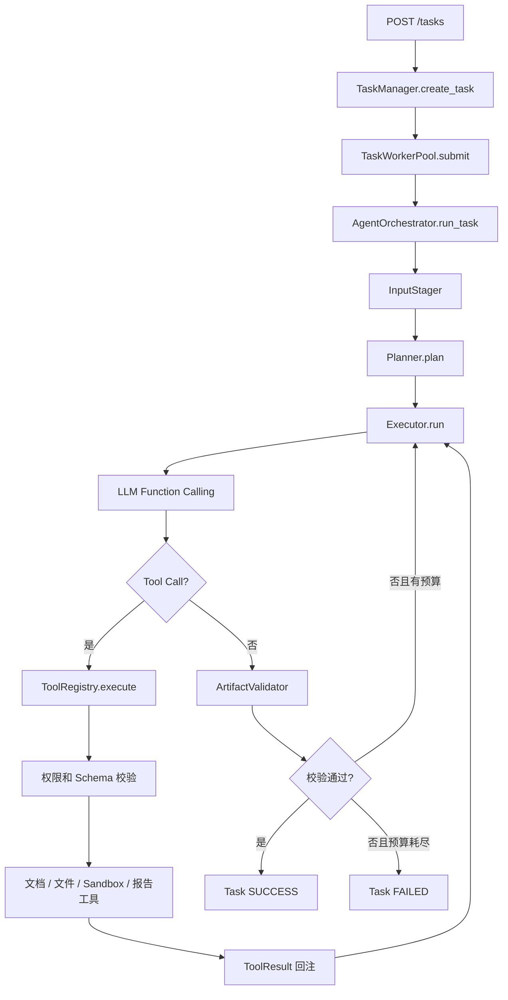

# Document Specialist Agent — Harness V1 任务计划

> 审计日期：2026-09-17  
> 审计分支：`main`  
> 审计基线：`1a2b7df12258f33e6912cb48f7118d051e38ee2b`  
> 第 2–5 节保留上述基线的审计快照；后续实现进度以各任务下的执行记录为准。
> 2026-09-18：P0-1、P0-2 已完成，P0-3 及后续编号尚未开始。

## 1. 最终定位

**Document Specialist Agent 是面向文档分析与代码执行场景的本地 Agent Harness。**

它不是单纯的文档解析工具，也不是以 Docker、MinIO 为主角的基础设施项目。AIO Sandbox、MinIO/S3 只是 Harness 管理的执行与产物后端；项目的核心是把开放式用户目标转换为边界明确、可追踪、可恢复的多步骤 Agent 任务。

Harness V1 的核心能力固定为：

1. Orchestrator–Planner–Executor 分层；
2. 结构化任务规划、执行绑定与局部重规划；
3. 多轮 Function Calling / Tool Calling；
4. 可插拔 Tool Registry；
5. 上下文预算、大结果卸载、摘要压缩与熔断；
6. 任务/步骤状态与完整执行轨迹；
7. 错误分类、有限重试与安全终止；
8. AIO Sandbox 隔离执行；
9. 固定案例 Evaluation。

### 本阶段非目标

以下能力不进入 Harness V1，防止范围继续膨胀：

- PostgreSQL、pgvector 和向量数据库；
- 数据库 MCP；
- 多 Agent 协作；
- 复杂 Skills 市场；
- Kubernetes、分布式调度和生产级多租户；
- 为追求“技术栈丰富”而替换当前可用组件。

---

## 2. 本次审计纠正的旧结论

| 旧结论或容易误解的说法 | 当前真实情况 |
| --- | --- |
| 任务状态使用 SQLite | **不正确。**远端 `main` 使用 `FileTaskStore`，每个任务持久化为一份 JSON，通过临时文件 + `os.replace` 原子写入；仅支持单进程。 |
| 仓库已经有 Memory 模块 | **不正确。**当前 `main` 没有 `memory/` 目录，也没有长期记忆的写入、检索和上下文注入。 |
| 仓库已经有 Evaluation 模块 | **不正确。**当前 `main` 没有 `evaluation/` 目录；现有 `tests/` 是代码测试，不等于 Agent 效果评测。 |
| Planner 已生成步骤 ID、依赖和完成条件 | **不正确。**当前 `PlanStep` 只有 `name / description / tool`，计划只是有序列表。 |
| Executor 已把 Tool Call 绑定到计划步骤 | **不正确。**Executor 仅把计划摘要放入 Prompt；运行时创建的 `TaskStep` 实际对应工具调用，名称也是工具名，没有计划步骤 ID。 |
| 已支持工具失败后的局部重规划 | **不正确。**工具错误会回注模型，模型可以在 ReAct 循环中换路，但 Planner 不会收到执行观察，也不存在显式的局部重规划。 |
| 已实现通用上下文治理 | **不正确。**`parse_document` 有字符截断并把完整 Markdown 留在沙箱，但还没有 Token 估算、通用大结果 Hook、result_ref 回读、消息组压缩和熔断。 |
| 沙箱超时问题仍是当前阻塞项 | **已按项目最新真实验收结论更新为“已解决/已通过当前烟测门槛”。**当前实现使用一次一会话、finally 删除会话、超时/不确定状态终止任务且禁止重放；`security_smoke.py` 包含延迟写文件探针。仍需保留边界：该探针不能证明任意恶意派生进程都一定被杀死。 |
| README 中的 242 passed / 1 skipped 是本次重新执行结果 | **不是。**这是当前 README 和提交记录中的基线，本次 GitHub 代码审计没有重新运行远端测试。 |

> `docs/verification/01_security.md` 是 2026-09-07 的历史快照，仍记录当时“真实 Docker 未验证”。后续应新增当前验证记录，不应篡改历史快照。

---

## 3. 当前入口与核心调用链

### 3.1 服务入口

- 进程入口：`api/app.py:app`
- 依赖装配：`agent/wiring.py:build_orchestrator`
- 提交任务：`POST /tasks`
- 查询任务：`GET /tasks/{task_id}`
- 任务列表：`GET /tasks`
- 健康检查：`GET /health`

### 3.2 当前真实调用链



### 3.3 一次任务的实际过程

1. FastAPI 校验请求和可选的 `X-API-Token`。
2. `TaskManager` 创建状态为 `CREATED` 的任务，并由 `FileTaskStore` 落盘。
3. 有界 `TaskWorkerPool` 接收任务；容量耗尽时返回 429，并把任务标记为失败。
4. Orchestrator 将任务置为 `RUNNING`。
5. `InputStager` 创建任务独立目录，并将声明的对象存储输入装载到沙箱。
6. Planner 强制模型调用 `create_plan`，得到有序步骤列表。
7. Executor 把用户目标、计划摘要和输入路径组装为 Prompt。
8. Executor 进入最多 8 轮的 Tool Calling 循环。
9. Tool Registry 完成工具查找、JSON Schema 校验、权限校验和任务命名空间改写。
10. 工具结果被封装为 `ToolResult` 并作为 `role=tool` 消息回注模型。
11. 每次实际工具调用生成一个 `TaskStep`，记录状态、输出、错误、耗时和尝试次数。
12. 模型停止调用工具后，Orchestrator 校验本轮产物。
13. 产物缺失或不一致时，在有限预算内携带失败原因重新执行；否则任务成功或失败。
14. LLM、重试、安全、校验和恢复事件随任务 JSON 持久化。

---

## 4. 当前模块职责

| 模块 | 当前职责 | Harness 判断 |
| --- | --- | --- |
| `api/app.py` | HTTP API、鉴权、生命周期、后台池接入 | 已形成清晰入口 |
| `api/workers.py` | 有界线程池、排队、拒绝和统计 | 已实现本地异步执行 |
| `agent/wiring.py` | 统一装配 LLM、工具、存储、沙箱和 Orchestrator | 已具备 Composition Root |
| `agent/orchestrator.py` | 驱动任务生命周期、输入装载、规划、执行、产物验证与有限修复 | 主体已完成 |
| `agent/planner.py` | 强制结构化生成有序计划 | 只完成静态初始计划 |
| `agent/executor.py` | 多轮 Tool Calling、工具结果回注、最大轮数、重试事件 | ReAct 主循环已完成；缺少计划绑定和上下文治理 |
| `agent/llm_client.py` | OpenAI 兼容调用、显式超时、统一重试、事件记录 | 已完成调用边界；缺 Token/成本计量 |
| `agent/validator.py` | 回查对象存储中的产物存在性、大小和一致性 | 已实现产物级确定性验证 |
| `tools/` | BaseTool、ToolResult、Registry 和四个内置工具 | 工具层较完整 |
| `task/` | 任务/步骤状态机、Manager、JSON 文件存储、僵死任务回收 | 单进程本地持久化已完成 |
| `retry/` | 错误分类、指数退避、随机抖动和重试安全判断 | 已完成 |
| `security/` | 工具/权限白名单、路径和对象键边界、任务命名空间 | 已完成原型边界 |
| `sandbox/` | AIO Sandbox SDK 防腐层、输入装载、旧式 OSS 生命周期 Hook | 执行后端已接入；现有 Hook 不是上下文 Hook |
| `storage/` | MinIO/S3 对象存储、上传下载、对象检查和预签名 URL | 已完成产物后端 |
| `tests/` | Fake LLM/SDK/S3 的单元和集成测试 | 工程测试较完整，但不是 Agent Evaluation |
| `memory/` | 当前不存在 | 待实现 |
| `evaluation/` | 当前不存在 | 待实现 |

---

## 5. 当前能力与目标差距

| 能力 | 当前状态 | 差距 |
| --- | --- | --- |
| O-P-E 分层 | 已实现 | 职责基本清楚 |
| ReAct / Tool Calling Loop | 已实现 | 缺上下文预算和计划进度控制 |
| 最大迭代次数 | 已实现 | 固定为 Executor 构造参数，尚无任务级总预算 |
| Tool Registry | 已实现 | 可补生命周期 Hook，但不需要重写 |
| 结构化规划 | 部分实现 | 缺 step_id、依赖、完成条件、计划持久化 |
| Tool Call 与计划绑定 | 未实现 | 当前 TaskStep 只是工具调用记录 |
| 局部重规划 | 未实现 | 当前只有模型在 Executor 内自行换路 |
| 上下文长度估算 | 未实现 | LLM 调用前没有 Token 预算判断 |
| 大结果卸载和引用 | 局部实现 | 仅 parse_document 特例，没有通用 OutputStore/result_ref |
| 二次回读 | 未实现 | 没有 read_tool_output 工具 |
| 消息组摘要压缩 | 未实现 | 没有压缩器、完整工具消息组保护 |
| 压缩失败熔断 | 未实现 | 可能在未来压缩调用中产生二次失控 |
| 状态持久化 | 已实现 | JSON 单进程，不是 SQLite；当前规模够用 |
| 异常分类和重试 | 已实现 | 规则和轨迹较完整 |
| 沙箱隔离 | 已实现原型 | 仍是单容器共享内核，不是“一任务一容器” |
| 产物可信性 | 已实现 | 验证对象存在、非空和大小，不验证报告语义正确性 |
| 长期记忆 | 未实现 | 没有写入策略、存储、检索和注入 |
| Evaluation | 未实现 | 只有 pytest，没有固定 Agent 任务集和效果指标 |
| Token/成本 | 未实现 | LLM 事件没有 prompt/completion/total token |
| 中断后继续执行 | 未实现 | 能回收僵死状态，但不能从 Agent Loop checkpoint 续跑 |

---

# 6. 开发任务

## P0：使当前简历中的 Harness 核心承诺真实闭环

P0 完成前，不新增 PostgreSQL、向量记忆、MCP 或多 Agent。

### P0-1：建立可执行的结构化计划模型

**状态：已完成（2026-09-18，功能分支 `feat/harness-p0-1`）**

最小修改方案：复用 O-P-E、FileTaskStore 和既有工具调用记录。将 Plan/PlanStep
移到不依赖 LLM 的 `task/plan_model.py`，从 `agent/planner.py` 保留兼容导出；
Planner 校验模型响应，Orchestrator 在 Executor 之前调用 `TaskManager.set_plan`。
本轮不实现 DAG 调度、完成条件判定、Tool Call 绑定或重规划。

实际修改：`task/plan_model.py`、`agent/planner.py`、`agent/orchestrator.py`、
`task/task_model.py`、`task/task_manager.py`，以及对应测试和 README。

完成内容：

- `step_id`、`depends_on`、非空字符串列表 `completion_criteria`、可选 `tool`；
- JSON Schema 校验字段类型，领域模型检查非空文本、重复 ID、缺失依赖、重复依赖及环；
- 支持合法但非拓扑顺序输入的 DAG，当前只校验、不调度；
- 计划版本由 Runtime 设为 1，完整计划在执行前保存至 `Task.plan`；
- `Task.steps` 继续表示实际工具调用，计划步骤不混入调用记录；
- 初始计划只允许写入一次，拒绝错任务、错误版本及非法生命周期写入；
- `GET /tasks/{id}` 经现有序列化直接返回 `plan`，版本位于 `plan.version`；
- 旧任务缺少 `plan` 时读取为 `None`，不伪造历史计划、不需要迁移文件；
- 非法计划和计划落盘失败均阻止 Executor 执行。

验收证据：新增测试先在旧代码上得到 21 项预期失败；实现后相关测试 125 passed；
补充模型响应、生命周期、保存失败边界后，全量 **276 passed**（Linux / Python 3.12.14 / pytest 9.1.1）。
一条 Starlette/AnyIO 弃用警告；本轮未调用真实 LLM、Docker 或 MinIO。
旧安全测试仅更新 FakePlanner 输入，使其满足新计划契约，原安全断言全部保留。

调用链：`Planner.plan → Schema + DAG 校验 → TaskManager.set_plan → FileTaskStore`
，保存成功后才进入原有 `Executor.run`。学习说明及完整验收记录见
[`docs/verification/02_plan_model.md`](docs/verification/02_plan_model.md)。

**目标**

让 Planner 输出真正可由 Runtime 管理的计划，而不是只供模型阅读的文本列表。

**修改范围**

- `agent/planner.py`
- `task/task_model.py`
- `task/task_manager.py`
- 对应 Planner、Task 测试

**实现要求**

- `PlanStep` 增加：
  - `step_id`
  - `depends_on`
  - `completion_criteria`
  - 推荐工具（可选）
- 校验步骤 ID 唯一、依赖存在、依赖无环。
- 将初始计划持久化到 Task，查询 API 能看到计划及版本。
- 区分“计划步骤”和“工具调用记录”，不要继续把二者混为一个 TaskStep。
- 计划解析失败必须让任务明确失败，不能降级为空计划执行。

**验收**

- 合法 DAG 计划可创建、序列化和恢复。
- 重复 ID、缺失依赖、循环依赖被拒绝。
- 重启进程后仍能查询原始计划。
- 旧任务记录有兼容读取策略或明确迁移方案。

### P0-2：绑定执行步骤并实现局部重规划

**状态：已完成（2026-09-18，基于 `7d97c34f5febda1b9a42fef2e127349f353f2160`）**

最小修改方案：沿用既有 ReAct 循环、工具注册表和计划落盘，只补一层计划运行时。
新增纯计算的 `task/plan_state.py`（由 append-only 事件派生步骤状态与可调度集合）；
`TaskStep` 增加 `plan_step_id`/`tool_call_id`，`Task` 增加 `plan_events` 与
`apply_replan`；Executor 给工具 schema 注入必填 `plan_step_id`（调用前剥离），
在循环内拦截两个运行时控制调用 `complete_plan_step` 与 `request_replan`，
并给 Planner 增加 `replan`。不重写循环，不新增工具、权限或存储后端。

实际修改：`task/plan_state.py`（新增）、`task/plan_model.py`、
`task/task_model.py`、`task/task_manager.py`、`agent/executor.py`、
`agent/planner.py`、`agent/orchestrator.py`、`agent/wiring.py`，以及对应测试、
README 和验证文档。未改动 `tools/`、`security/`、`retry/`、`core/config.py`、`api/`。

完成内容：

- 每个 Tool Call 记录 `plan_step_id` 与 `tool_call_id`；绑定事件带版本与是否隐式绑定；
- 只调度依赖已完成的计划步骤：违规绑定不执行工具、不产生 `TaskStep`，只回注观察；
- 已完成步骤不可重放，`Task.apply_replan` 还要求它们在版本 +1 中逐字段不变；
- 步骤完成由 `completion_criteria` 证据判定（`complete_plan_step`），
  工具返回 success 不再等于业务步骤完成；
- 局部重规划只在工具不可恢复失败、必要数据缺失、完成条件未满足、
  原计划依赖失效四类原因码下由模型请求，输入包含目标、当前计划、
  已完成步骤+证据、失败观察和可用工具；
- 工具错误只作为观察回注，不会无条件触发重规划；
- 新计划版本 +1，保留已完成步骤，只替换未完成部分；
- `max_replans` 预算（Executor 构造参数，默认 2）耗尽后抛
  `ReplanBudgetExceededError`，任务明确失败；
- `plan_events` 记录创建、绑定、完成、失败、重规划请求/拒绝/应用/耗尽与收尾，
  随任务 JSON 落盘，重启后经 `GET /tasks/{id}` 可查。

验收证据：新用例先在旧代码上得到 2 个模块导入失败 + 14 项失败；实现后相关测试
214 passed（1 skipped）；完整 `python -m pytest -q` **323 passed，1 skipped**
（基线 275 passed / 1 skipped，Windows 11 / Python 3.13.2 / pytest 9.1.1）。
本轮未调用真实 LLM、Docker 或 MinIO；`docs/verification/01_security.md` 作为历史快照未改动。

调用链：`Executor.run → PlanRunState(plan, plan_events) → 工具 schema 注入
plan_step_id → 绑定门禁 → ToolRegistry.execute → 观察回注 /
complete_plan_step → plan_step_completed / request_replan → Planner.replan →
TaskManager.replace_plan → FileTaskStore`。完整学习说明与验收记录见
[`docs/verification/03_execution_binding.md`](docs/verification/03_execution_binding.md)。

**目标**

让 Executor 清楚“当前正在完成哪个计划步骤”，并在现实观察与初始计划脱节时进行有边界的局部重规划。

**依赖**

P0-1。

**修改范围**

- `agent/executor.py`
- `agent/planner.py`
- `agent/orchestrator.py`
- Task 计划/事件模型
- 对应 Executor、Orchestrator 测试

**实现要求**

- 每个 Tool Call 记录 `plan_step_id` 和 `tool_call_id`。
- 只调度依赖已完成的计划步骤。
- 根据 `completion_criteria` 判断步骤完成，而不是“工具返回 success 就一定完成业务步骤”。
- 仅在以下情况触发局部重规划：
  - 工具不可恢复失败；
  - 必要数据缺失；
  - 完成条件未满足；
  - 原计划依赖不再成立。
- 重规划输入必须包含：原目标、当前计划、已完成步骤、失败观察、可用工具。
- 已完成步骤不可被重放；新计划保留来源和版本。
- 设置 `max_replans`，超过预算后明确终止。
- 记录 `plan_events`：创建、步骤绑定、完成、失败、重规划原因和版本。

**验收**

- 工具调用能准确追溯到计划步骤。
- 普通工具错误只回注观察，不会无条件重规划。
- 构造“数据缺失”和“完成条件不满足”案例时，只替换未完成部分。
- 达到重规划上限后任务终止，不会形成 Planner–Executor 无限循环。

### P0-3：实现通用工具大结果卸载与二次回读

**目标**

任何工具的大结果都不能直接撑爆模型上下文。

**修改范围**

- 新增本地 `ToolOutputStore`
- 新增 `AfterToolCall` 上下文 Hook
- 新增 `read_tool_output` 工具
- `tools/tool_registry.py`
- `agent/executor.py`
- Task 工具结果引用字段
- 对应安全与回读测试

**实现要求**

- 工具执行后统一经过 Hook；当前 `sandbox/hooks.py` 的 OSS 搬运 Hook 与此职责不同，不要直接混用。
- 小结果原样回注。
- 大结果完整写入本地受控目录，上下文只保留：
  - preview
  - result_ref
  - 总大小
  - 内容类型
  - 回读提示
- `result_ref` 必须是不可伪造的逻辑引用，模型不得直接提供文件路径。
- `read_tool_output` 按 offset/limit 或页码分页读取。
- 引用必须绑定 task_id，拒绝跨任务读取和路径穿越。
- TaskStep 不再重复持久化整份超大输出，只保存预览与引用。

**验收**

- 大结果不会出现在发送给 LLM 的消息全文中。
- 结果文件能够在任务重启后继续回读。
- 非法引用、跨任务引用、越界路径被拒绝。
- 回读仍受单次字符/Token 预算限制，不能一次重新塞回全部内容。

### P0-4：实现上下文预算、完整消息组压缩与熔断

**目标**

使长任务在接近上下文窗口时主动收敛，而不是等模型 API 报超长错误。

**依赖**

P0-3。

**修改范围**

- 新增 `TokenEstimator`
- 新增 `ContextManager`
- 新增 `ContextCompactor`
- `agent/executor.py`
- `core/config.py`
- 上下文相关测试

**实现要求**

- 每次 LLM 调用前估算：
  - System Prompt
  - 用户目标
  - 当前计划
  - 历史消息
  - Tool Call / Tool Result
  - 已有摘要
- 估算优先级：真实 usage（用于校准）→ tokenizer（可用时）→ 字符数折算兜底。
- 设置 soft limit、hard limit 和压缩目标值，并为模型输出预留空间。
- 压缩以完整消息组为单位，绝不能拆散 assistant tool call 与对应 tool result。
- 保留用户目标、约束、活动计划、已确认事实、结果引用、未完成事项和最近消息组。
- 摘要输出采用结构化 Schema。
- 压缩请求自身过长时，逐步移除最早完整组后有限重试。
- 连续失败后打开熔断器，使用确定性裁剪；仍超过 hard limit 才终止任务。
- 记录 `context_events`：估算、卸载、压缩、重试、熔断和最终大小。

**验收**

- 达到 soft limit 后压缩到目标区间。
- Tool Call 与 Tool Result 始终配对。
- 压缩连续失败不会无限调用模型。
- 熔断后的确定性裁剪仍保留任务目标、活动计划和 result_ref。
- 超过 hard limit 且无法安全收敛时，任务给出明确终止原因。

### P0-5：补齐 Harness V1 回归测试和真实验证记录

**目标**

让每一条核心简历描述都有代码位置和测试证据。

**实现要求**

- 新增端到端 Fake LLM 场景：
  - 静态计划正常完成；
  - 工具失败后换路；
  - 数据缺失触发局部重规划；
  - 大结果卸载和分页回读；
  - 上下文压缩；
  - 压缩熔断；
  - 最大执行轮数；
  - 最大重规划次数。
- 运行完整 pytest 回归。
- 使用真实 Docker 再运行 `demo.security_smoke`。
- 新增一份当前日期的验证文档，记录：
  - commit SHA；
  - OS、Python、Docker、SDK 和镜像版本；
  - pytest 结果；
  - security_smoke 完整输出；
  - 超时探针通过结果；
  - “不能证明任意派生子进程都被终止”的边界。
- 保留 `docs/verification/01_security.md` 作为历史快照，不修改历史结论。

**P0 完成定义**

完成 P0 后，以下简历关键词才可以无保留使用：

- 动态任务规划；
- Tool Call 与计划步骤绑定；
- 局部重规划；
- Hook 大结果卸载；
- result_ref 二次回读；
- 完整消息组压缩；
- 压缩重试与熔断；
- Agent Harness。

---

## P1：补充 Harness 的学习价值和效果证明

### P1-1：本地长期记忆（不做向量化）

**目标**

实现可解释、低复杂度的跨任务记忆，不引入 PostgreSQL 和向量数据库。

**建议方案**

- 使用 SQLite 保存记忆；这与当前 JSON TaskStore 可以并存，不强制迁移任务存储。
- 记忆类型：
  - 用户明确偏好；
  - 项目固定约束；
  - 已确认业务口径；
  - 成功验证的处理经验。
- 任务结束后：候选提取 → 价值判断 → 脱敏 → 去重 → 来源标记 → 写入。
- 新任务开始时：user/project/type 过滤 → 关键词检索 → Top-K → 注入 Planner/Executor。
- 增加 `search_memory` 工具，支持执行中按需二次召回。
- 错误推测、大段原始对话、敏感凭证禁止写入。
- 记忆必须包含 source_task_id、confidence、status 和时间信息。

**验收**

- 任务完成后只保存符合规则的记忆。
- 新任务能召回同一用户/项目的相关记忆。
- 不同用户/项目不会串线。
- 删除或失效记忆后不再注入。
- 召回结果有来源，不把模型推测当事实。

> P1-1 完成前，项目简介不要写“本地长期记忆已经实现”。

### P1-2：建立独立 Evaluation

**目标**

区分“代码是否正确”和“Agent 是否有效”。

**实现要求**

- 新建 `evaluation/`。
- 固定案例至少覆盖：
  - 文档解析；
  - 结构化数据统计；
  - 需要生成产物的任务；
  - 缺失数据；
  - 工具参数错误；
  - 工具瞬态故障；
  - 大型工具输出；
  - 局部重规划；
  - 记忆召回（P1-1 完成后）。
- 指标：
  - 任务完成率；
  - 工具选择正确率；
  - 计划步骤完成率；
  - 产物校验通过率；
  - 平均 Tool Call 次数；
  - 平均重规划次数；
  - 失败恢复率；
  - 平均 Token；
  - P95 时延。
- Fake LLM 用于确定性回归；真实模型评测单独运行并保留模型名、Prompt 版本和数据集版本。

### P1-3：Token、时延和成本计量

**目标**

补齐 Harness 的资源预算与可观测性。

**实现要求**

- 从模型响应记录 prompt/completion/total/cache tokens。
- 聚合到 task、phase 和 iteration。
- 记录模型、价格表版本和估算费用。
- 增加 soft budget 和 hard budget：
  - soft budget 触发上下文收敛；
  - hard budget 终止任务。
- 不把“估算费用”表述成供应商最终账单。

---

## P2：增强可恢复性与本地使用体验

### P2-1：Agent Loop checkpoint 与会话自愈

- 在每轮 LLM/工具执行后保存 checkpoint。
- 重启时恢复到最后一个确定状态，不重放状态未知的副作用工具。
- 调用模型前检查 tool_call_id 配对：
  - 缺 Tool Result 时补入“执行中断、结果未知”的合成结果；
  - 孤立 Tool Result 不进入模型上下文，但保留在轨迹中。
- 增加取消状态和用户主动终止接口。

### P2-2：本地产物后端

- 为 ArtifactStore 定义接口。
- 增加本地目录实现，让不需要共享下载链接的任务不必启动 MinIO。
- MinIO/S3 继续作为可选后端。
- 保留对象存储预签名 URL 能力，不删除现有实现。

### P2-3：CI 和可复现运行

- GitHub Actions：lint/type check/pytest。
- 固定依赖锁文件。
- 为 API 服务增加 Dockerfile。
- 区分离线测试、真实 Sandbox 烟测和真实 LLM 评测，避免混报。

---

## P3：未来增强，不进入当前简历主线

- 一任务一容器或沙箱池，解决单容器共享内核问题；
- Redis/数据库共享任务状态，支持多进程部署；
- 多租户账号、任务归属和审计；
- 向量长期记忆与混合召回；
- MCP 外部业务数据源；
- Skills/SOP 沉淀；
- Multi-Agent；
- 分布式追踪和生产部署。

只有出现真实使用需求时才进入 P3，不为简历堆叠组件。

---

## 7. 推荐实施顺序

```text
P0-1 结构化计划
  → P0-2 执行绑定与局部重规划
  → P0-3 大结果卸载与回读
  → P0-4 上下文压缩与熔断
  → P0-5 回归测试和真实验证
  → P1-1 本地长期记忆
  → P1-2 Evaluation
  → P1-3 Token/成本
  → P2 可恢复性和本地体验
```

每次只完成一个编号。开始编码前必须：

1. 读取本文件和涉及模块；
2. 描述当前实现；
3. 给出最小修改方案；
4. 列出修改文件；
5. 先写验收用例；
6. 确认不会整体重写已有架构。

完成后必须：

1. 运行本任务相关测试；
2. 运行完整回归；
3. 更新本文件状态；
4. 提交调用链和测试证据；
5. 不顺带实现下一个优先级。

---

## 8. Harness V1 最终验收标准

只有同时满足下列条件，项目才从“Agent Runtime 原型”升级为可在简历中完整描述的“Agent Harness”：

- 用户目标能生成带 ID、依赖和完成条件的结构化计划；
- Tool Call 能关联到计划步骤；
- 失败观察能触发有预算的局部重规划；
- Agent Loop 有最大轮数、重规划预算和明确终止原因；
- 所有工具经过 Registry、Schema 与权限校验；
- 超大工具结果自动卸载，模型可按引用分页回读；
- 上下文达到阈值时压缩完整消息组；
- 压缩失败有有限重试、熔断和确定性兜底；
- 任务、计划、步骤、工具调用、重试、压缩和恢复事件可追踪；
- 未知代码在 AIO Sandbox 中执行；
- 产物在任务成功前经过确定性校验；
- 固定 Evaluation 案例能够重复运行并输出指标；
- README、设计文档、测试结果和简历描述彼此一致。
